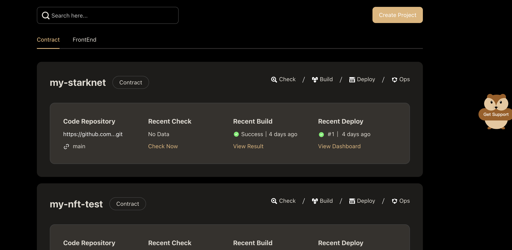
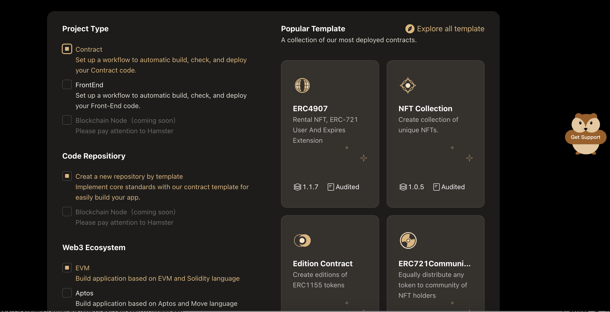
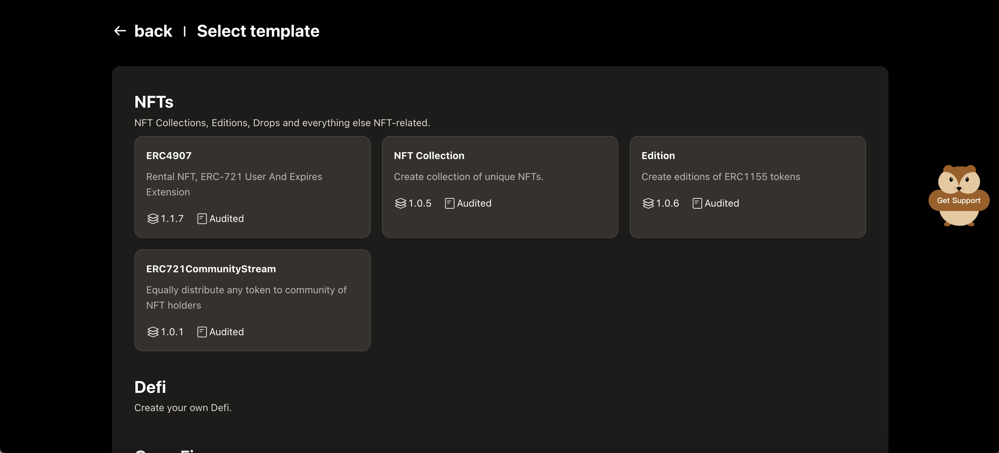
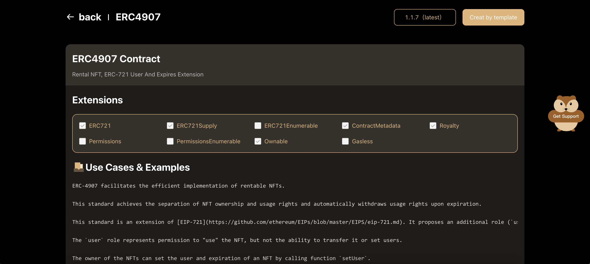

# Create Project for EVM

## Create EVM Project with Template

You can create a new project from the Hamster **project list** page by clicking on the **Create Project** button.

After going to the **Create Project** page，fill in the basic infomation of your own project first.

1. Enter the project name for you project. Great project names are short and memorable.
2. Select **contract** item of project type, the best practices workflow will be set up to assist you for completing project quickly.
3. Select **create a new repositiory by template** item of code repositiory to get started with one of our contract templates.
4. Click the **Explore all template** button to go to the **select template** page.

:::tip
About **popular template** area, Hamster will give you a collection of the most deployed templates.You can select one of these template, create your code repository to github quickly.
:::

After going to the **select template** page, you can view all of contract template.
The contract template library will cover four major scenarios：NFTs, Defi, GameFi, DAOs & Governance.
Click a template card for you want to go to the **template detail** page.

 On the ** template detail ** page，you can view detail info of the tamplate，include extensions, use cases & examples, resources, functions, events and sources.
After confirming that there is no problem with the template information, click the ** Create by template ** button to create project.

:::tip
In the upper right corner of the  ** template detail ** page, you can choose the required template version according to the actual situation.
:::

After created successfully, return to the project list to view the newly created project.

