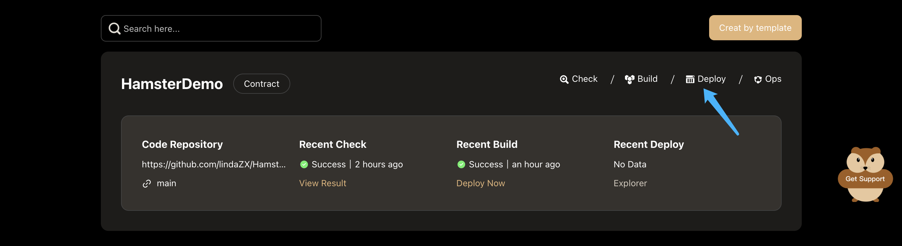

# Deploy EVM Contract
 
After the contract Building is completed by Hamster, you can also deploy this contract deployment by Hamster.

Click the **Deploy** button in the **contract project** card, to deploy the newly built contract.

After going to the **Contract Deploy** page，enter the basic infomation for deployment，including the contract version, the contract name, and the target network/chain.

:::tip
About **Contract Version**, When the contract building is completed, the hamster will automatically add the contract version number+1.
:::

After confirming the information, click the **deploy** button.
Then, the hamster will guide the connection wallet to complete the transaction and deploy the contract.

After the contract deployment is completed, the page will jump to the contract details page.
You can call the contract on this page to verify the contract.

