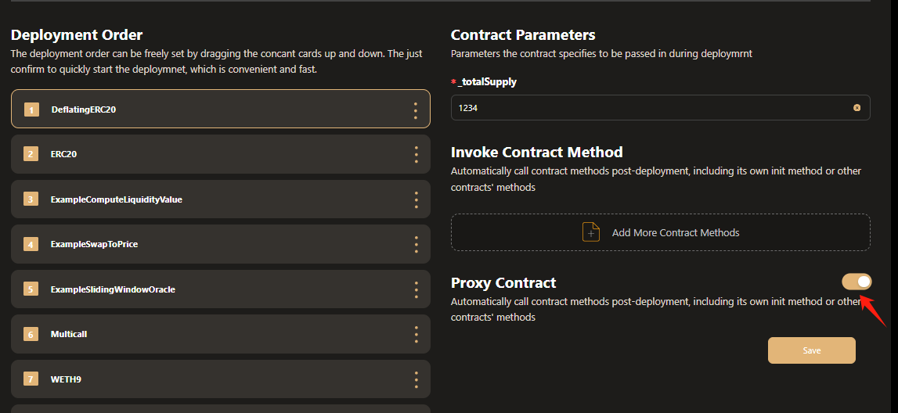
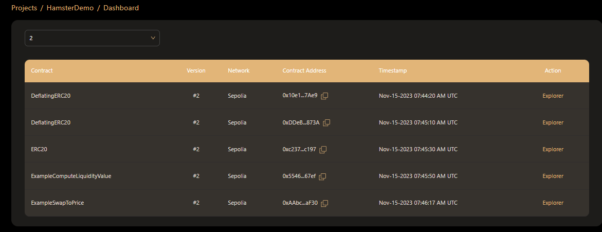

# Deploy EVM Contract
 
After the contract Building is completed by Hamster, you can also deploy this contract deployment by Hamster.

Click the **Deploy** button in the **contract project** card, to deploy the newly built contract.

## Deploy Setting  
Enter the deploy page and we provide the following settings for multi-contract deployment.  
### Select project version  
  
We provide you with all versions of contracts built on hamster to provide you with choices  
### Contract selection
When there are multiple contracts in your project, we provide a one-click deployment function. Before that, you can choose the contracts you need to deploy and the contracts that do not need to be deployed.  
#### Deployment Order

- 1 .You can use the mouse to drag the contract name to arrange the order of contract deployment.  
- 2 .Click the **Do Not Deploy** button in the contract name to choose not to deploy the contract  
- 3 .Click the **Duplicate** button in the contract name option. You can also copy its contract and deploy and test the copied contract at the same time.  
#### Skipped Contract Deployment

- When you want to deploy a skipped contract, you can click the aa button in the project name option to move the contract to the deployment area to wait for deployment.  
### Contract Parameters  
According to different construction methods of the contract, we provide different parameter configurations  

- When the constructor in the contract has no parameters, we will tell you that there is no parameter data. You can deploy the contract directly.  
  
- 1.When the parameter type of the constructor method in the contract is address, we provide two input methods  
  - 1 You can choose the **Select project contract** option to select the contract to be deployed in the project. After the deployment is successful, hamster will automatically obtain the address of the contract as an input parameter.  
  - 2 You can also select the **Manual input** option to manually enter the address as an input parameter
- 2.When the parameter type of the contract construction method is not address, you can manually enter the required data according to the type prompt of the input box.  
### Invoke Contract Method  
If you need to call the contract's method at the same time after deployment, hamster provides one-click synchronization operation. You only need to add configuration information.  
  
Proceed as follows  
- 1 .Select the contract and click the **Add More Contract Methods** option in the contract configuration column to add a contract.  
- 2 .Select the contract name and contract method to be called in **Method Name**  
- 3 .According to the parameters required by the selected method, fill in the corresponding type of input parameters just like the constructor method.  
- 4 .In addition to the parameters specified by the method, if you also need to carry additional input parameters, you can click the **Add Custom Params** button to enter custom parameters.  
- 5 .If you want to cancel the method call, you can click the **Delete** button in the method options bar to delete the configuration of the contract method

### Proxy Contract  
If you want to generate a proxy contract for this contract and deploy it synchronously, hamster can generate a proxy contract for your contract with one click and deploy it synchronously.  

You only need to select the contract and click the switch button next to the word **Proxy Contract** in the contract display area.  
### Select network  
After you configure the contract information, you only need to link the wallet and select the network for one-click deployment.  
  
If your wallet is already installed, you just need to click the **Connect Wallet** button to confirm the link.  
At the same time, we provide multiple mainstream networks under the evm system for you to choose from.  
## Deployment Details
Enter the aa page and you can see the project version you deployed, the link address of the project, and the time when the build was completed.  
  
In the contract list display below, you can see the display status of the contract in real time.  
  
 - During the deployment process, you do not need to perform many other operations. You only need to confirm the wallet signature of the contract and wait for the contract to be deployed successfully.  
 - For successfully deployed contracts, you can click on the display box of the contract to view the transaction information of the contract.  
 - If you want to view detailed contract transaction information, you can click the **view on block explore** button to jump to the blockchain browser for viewing.  
 - When the contract deployment fails, you can click the display box to view the reason for the failure, or click the redeploy button to **Redeploy** the contract.  
  
At the same time, hamster also provides some personalized settings during the deployment process.  

- Click stop to pause the contract being deployed and wait until it needs to be deployed before restarting it.  
- Click the **View Setting** option to view the deployment contract configuration information, including contract methods and parameters, etc.  
- Click **View Dashboard** to jump to the **Dashboard** page to view all contract management successfully deployed in the project  
