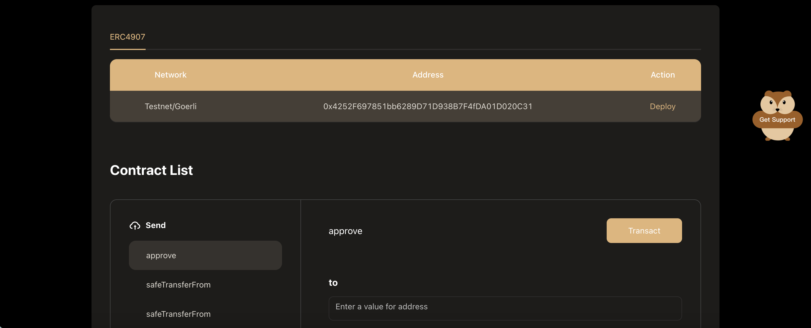

# Exploring EVM Contract

You can extract some information about Hamster deploy Smart Contract instances in the Explorer. 

To entering a Smart Contract view, you can click the **Ops** button in a contract project card from the **project list**.

After going to the **Contract Detail** page,you can call methods on your Smart Contract instance.

:::tip
When the contract is deployed in multiple chains, first choose a chain in the upper table area, and then call methods on your Smart Contract instance.
:::