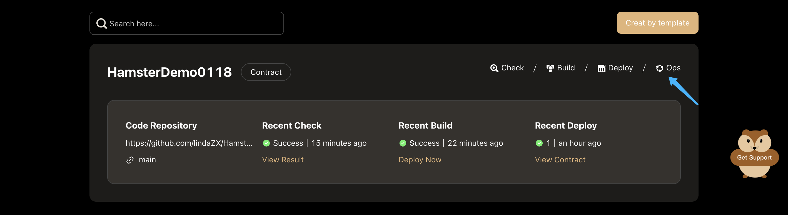
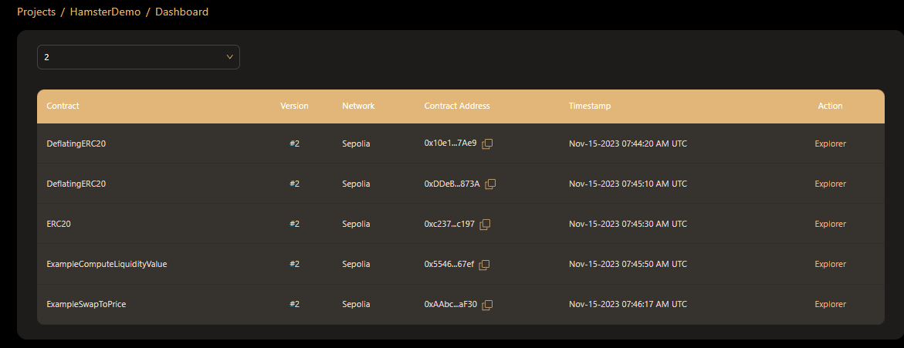
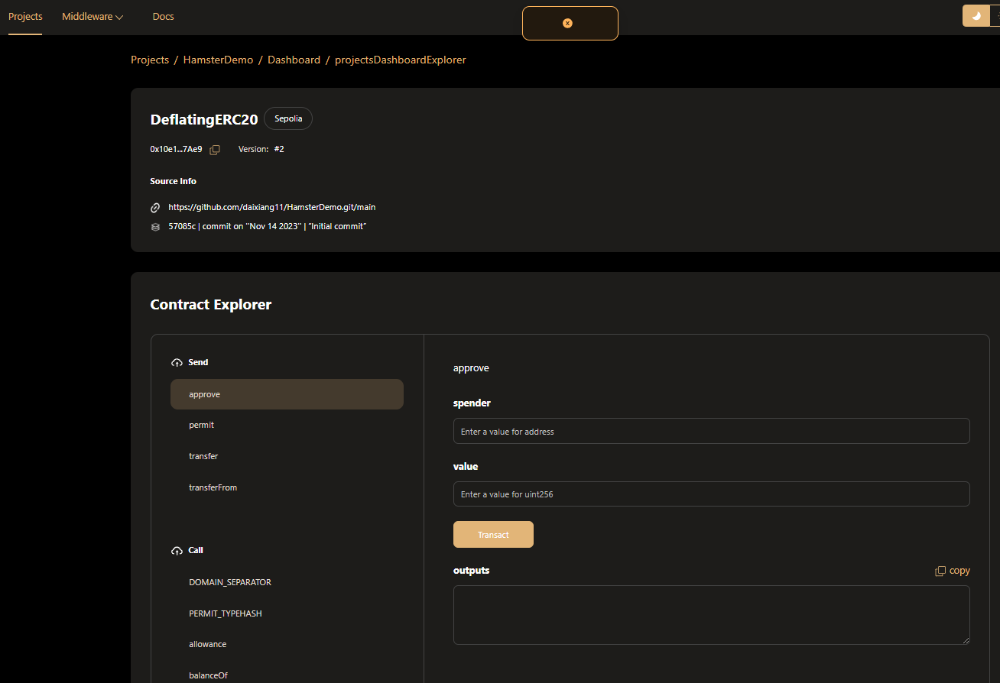

# Exploring EVM Contract

You can extract some information about Hamster deploy Smart Contract instances in the Explorer. 

To entering a Smart Contract view, you can click the **Ops** button in a contract project card from the **project list**.

At this point you will see all the contracts successfully deployed by the project

You can select the contract you want to call by using the contract’s name, version, network, deployment time, contract address and other information.  
You only need to click on the word **explorer** to enter the **projectsDashboardExplorer** page  

After going to the **projectsDashboardExplorer** page,you can call methods on your Smart Contract instance.

:::tip
When you want to call the instance method of the contract, you only need to select the corresponding method and enter the corresponding parameters according to the prompts.
::: 