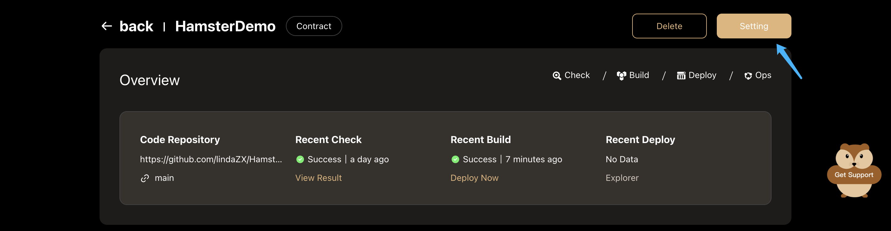
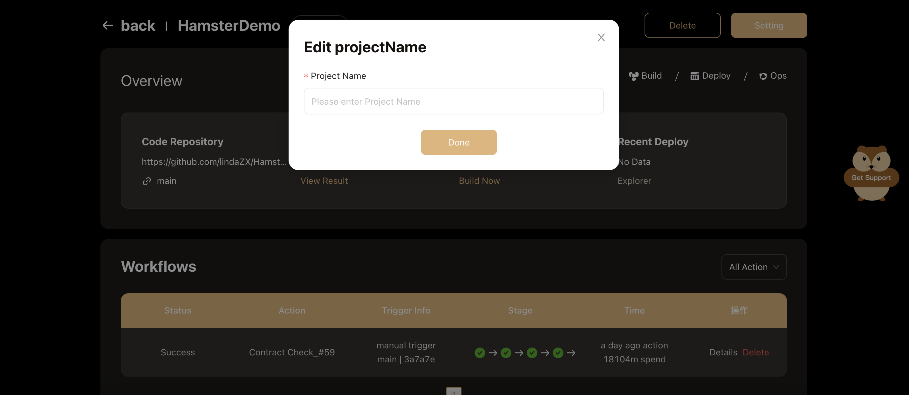

# Project Settings

To edit project settings, choose a project from the **project list**, then, click the **Setting** button.

## General Settings

### Project Name

Project names can only consist of up to 100 alphanumeric lowercase characters. Hyphens can be used between the name but never at the start or end.