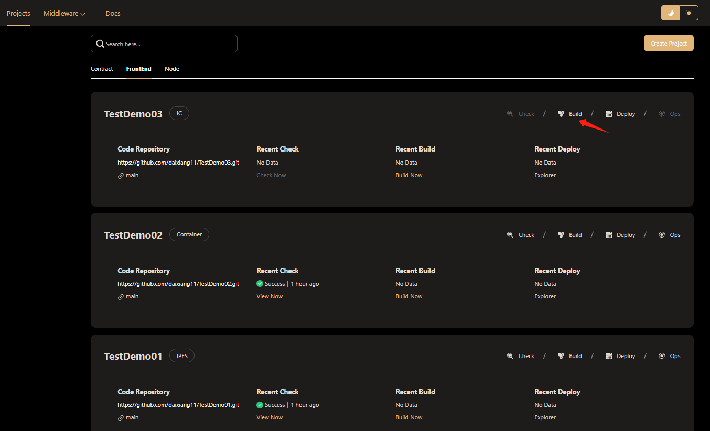
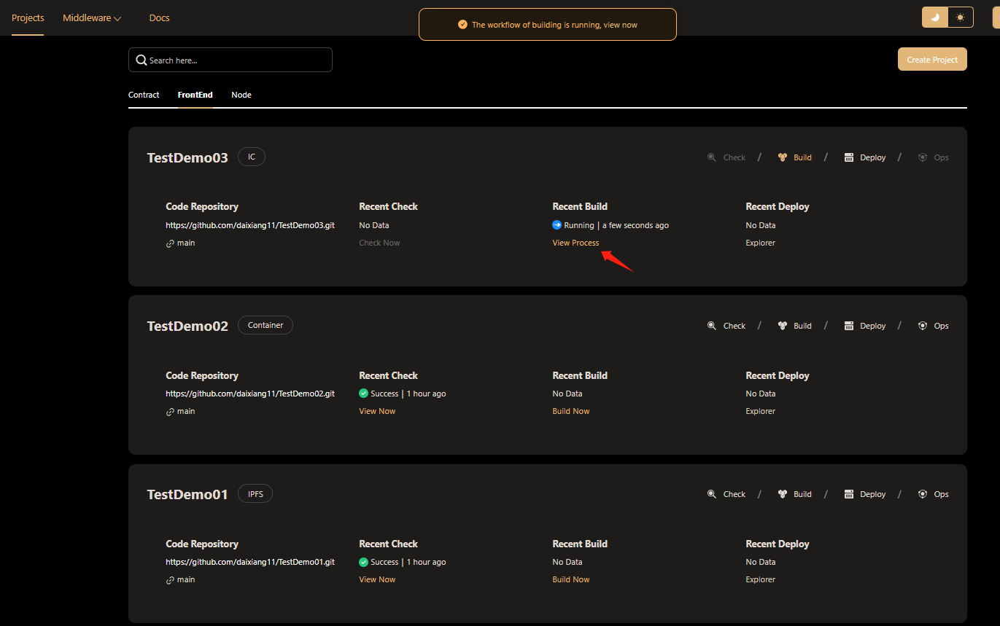
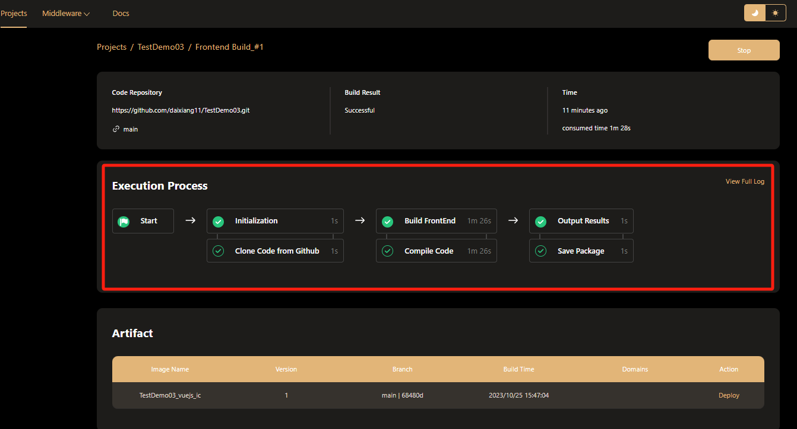
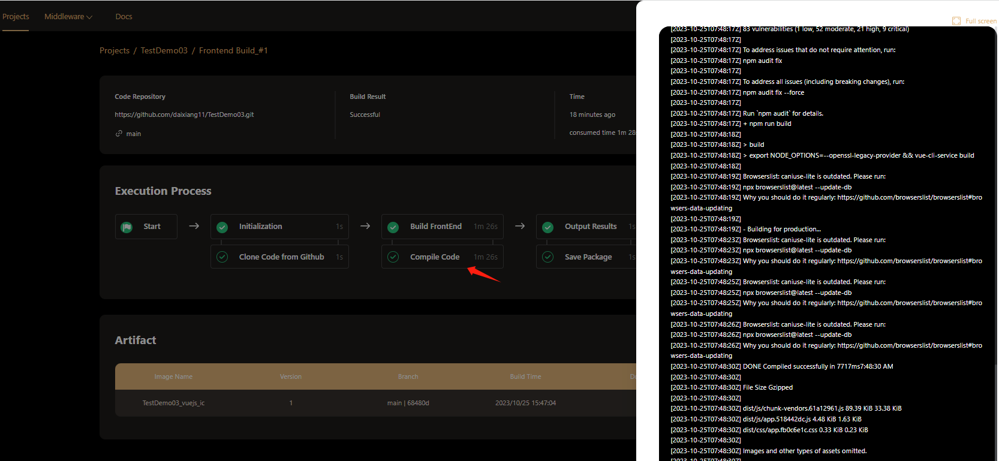
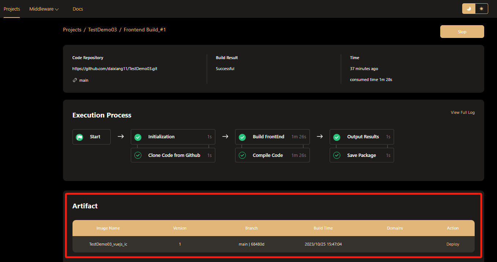
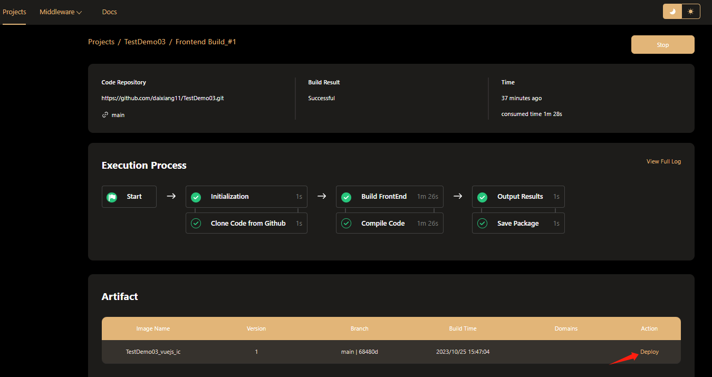

# Build Front-End Code
One-click update, instant build. Commit code to GitHub, click to build, Hamster takes over seamlessly. The intelligent system requires no manual intervention and development does not stop. Intelligent processes unleash creativity and allow ideas to take shape quickly. 
## Execute Building  
To build your project, click Build on the Front End Projects card.  
  
While the build workflow is in progress, click the View Process button to monitor the process.
  
Once the build workflow is complete, click Deploy Now for one-click deployment  
## View Execution Process
Hamster visually depicts the build workflow through an intuitive pipeline view. You can see all the built-in workflow nodes and the time each step takes.  
 
Click on any workflow node to view its execution log details. For example:  
 
## View Contract Artifact  
After the building is completed, the Contract List will be automatically displayed below the "Execution Process" area. Like this:  
 
Want to deploy this contract quickly? Click "Deploy" to enter the contract deployment page.  
 
