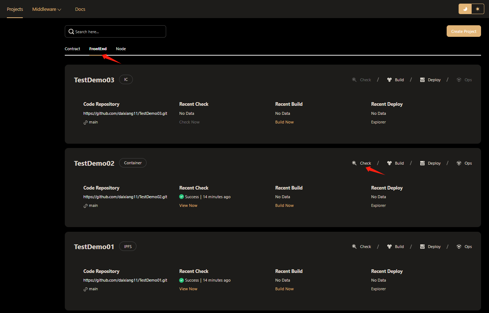
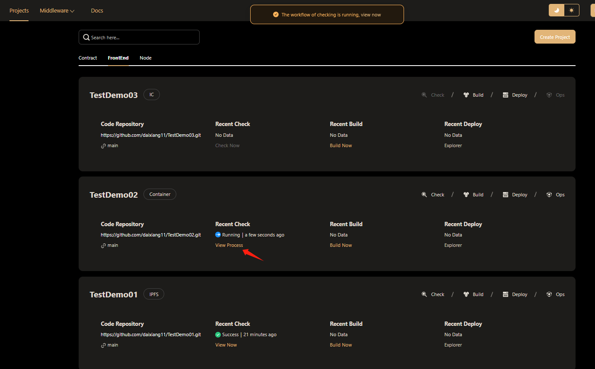
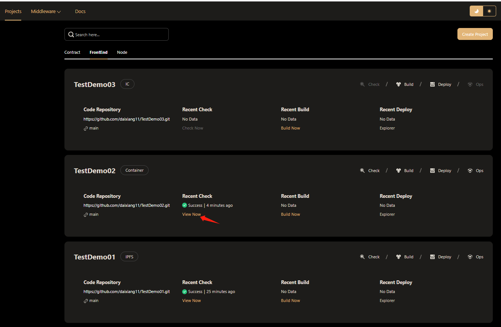
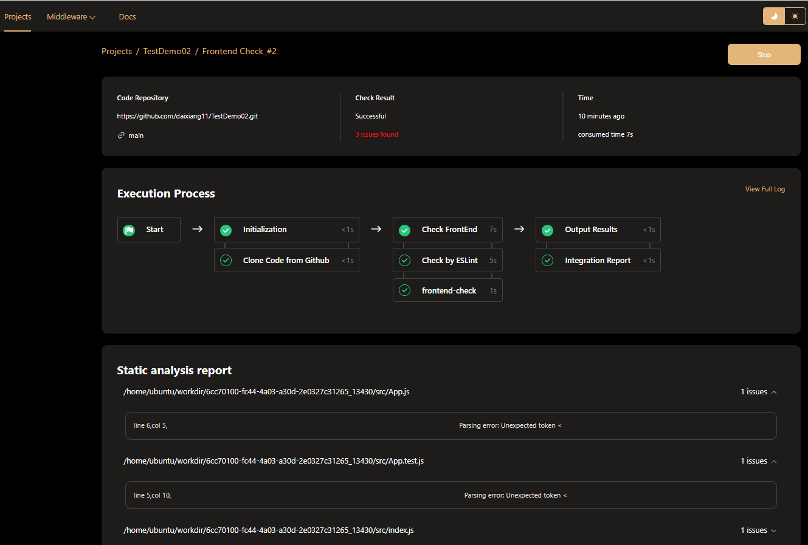
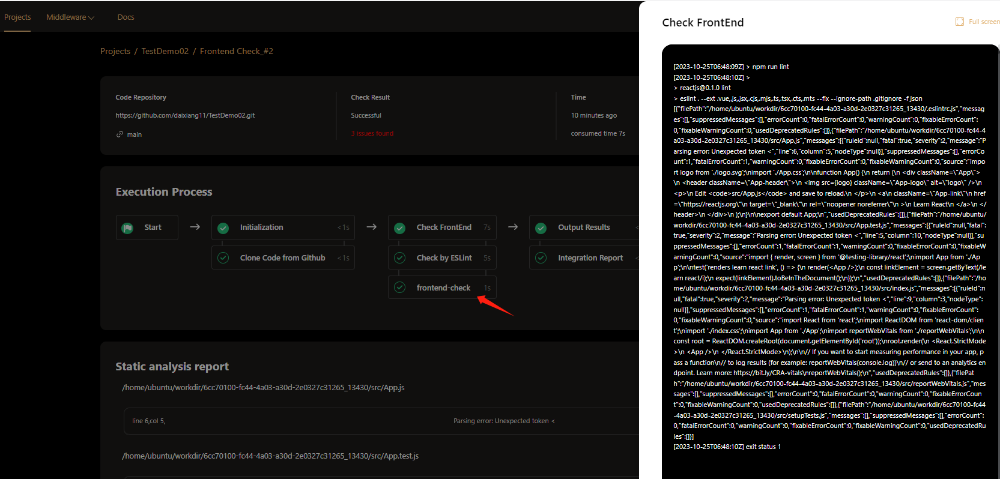
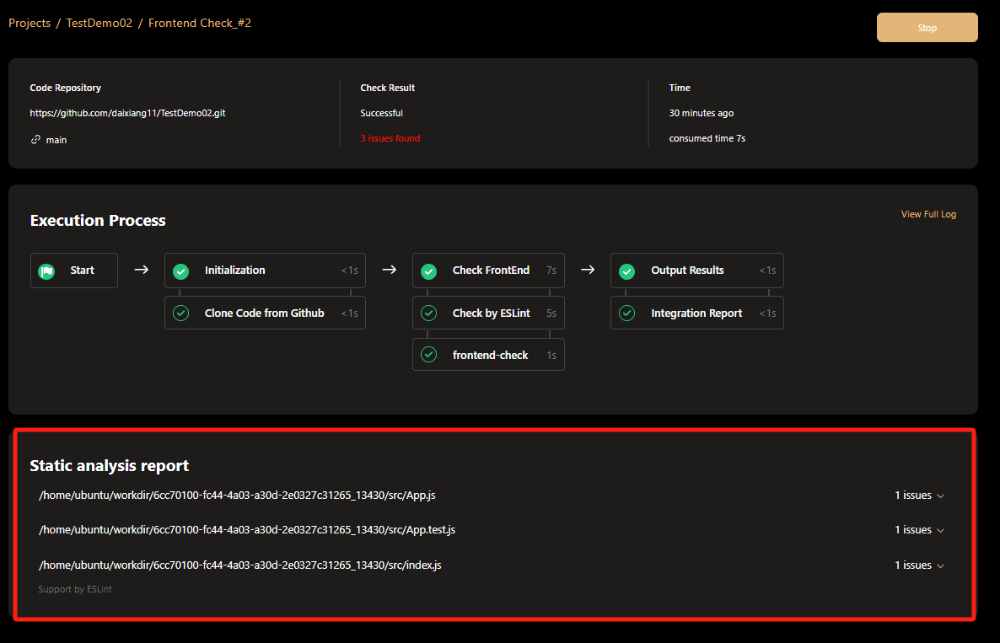

# Check Front-End Code
Hamster will conduct a comprehensive inspection of front-end projects, including security analysis and contract style specification inspection. The execution process is automatic and requires no human intervention.  
## Execute Checking
All front-end projects will be displayed on the front-end project list page after they are successfully created.  

Click the Check button in the contract project card, to check the contract.  

When the checking workflow is being executed, click the View Process button to view the process.
  
When the checking workflow is completed, click the View Now button to view the checking report.  
## View Execution Process  
Hamster show the Execution Process by visual pipeline, You can see all built-in work nodes and the time each one takes.  
  
Click each work node，you can see the Execution log of this work node. Like this:  

## View Static analysis report  
After the static code inspection is completed for the front-end code of the project, the corresponding result report will be generated.  

All contract code files with problems in the project will be displayed in this area. You can optimize and improve the smart contract based on the Static analysis report.
