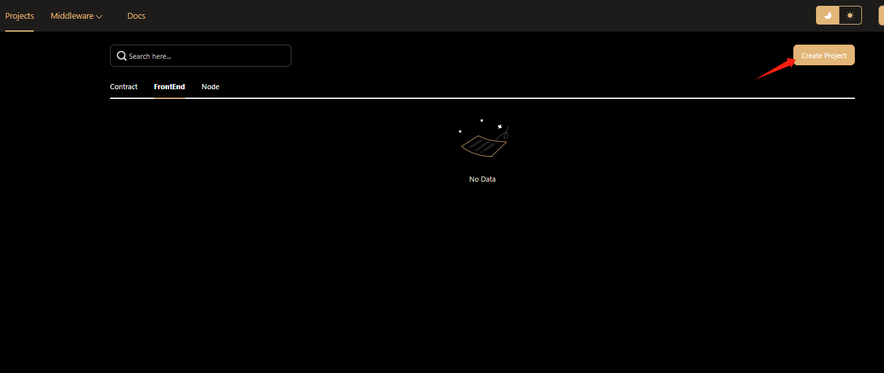
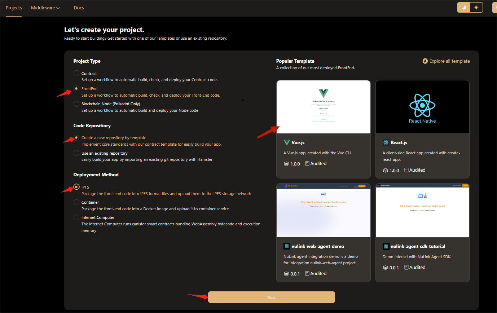
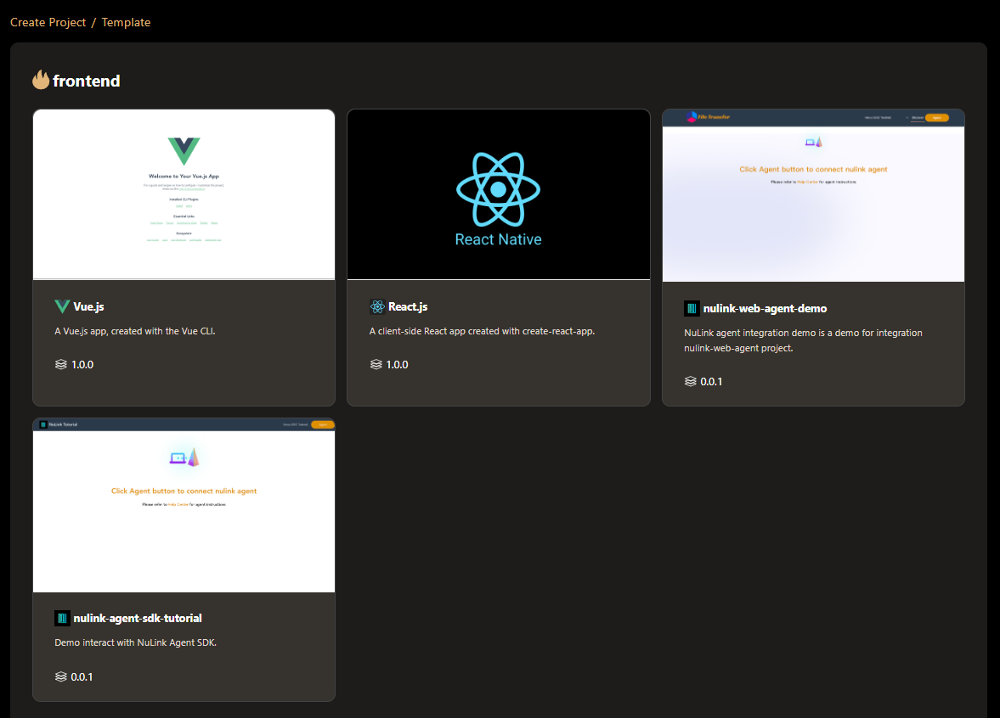
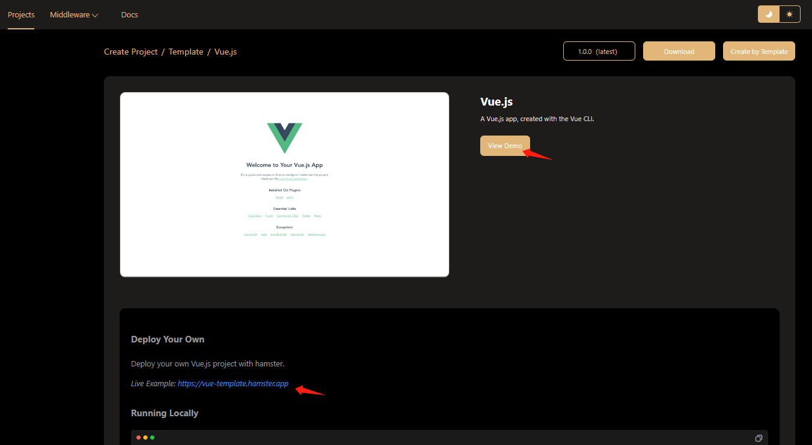
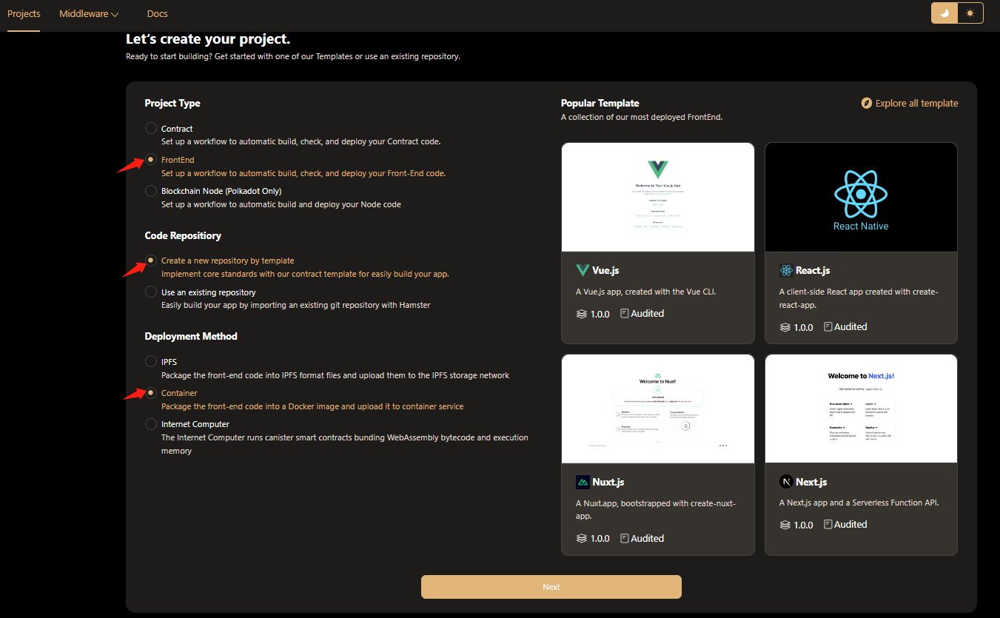
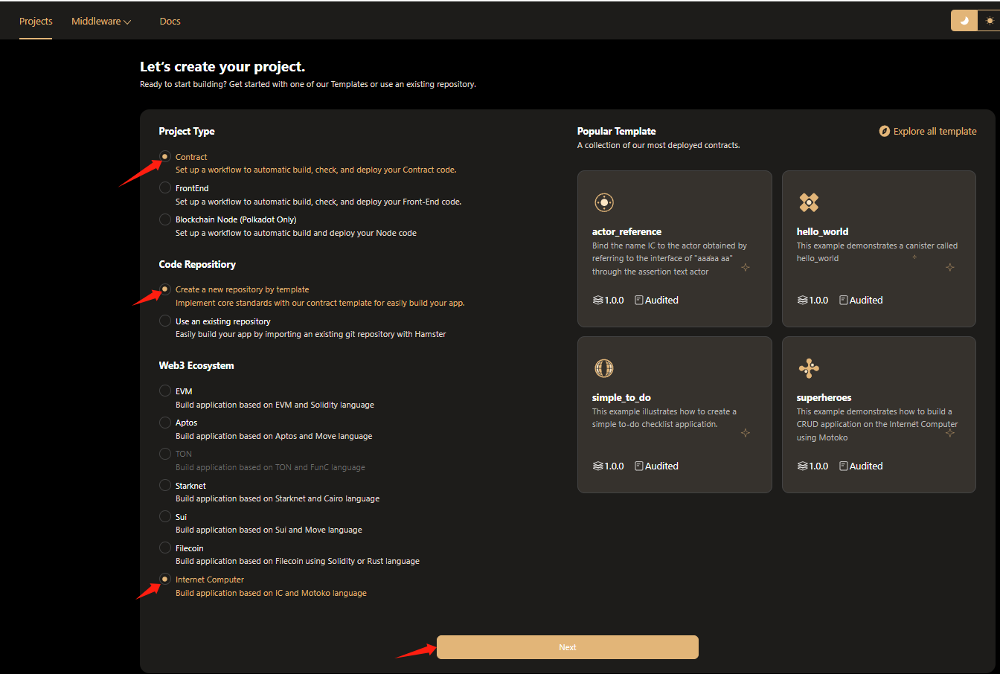
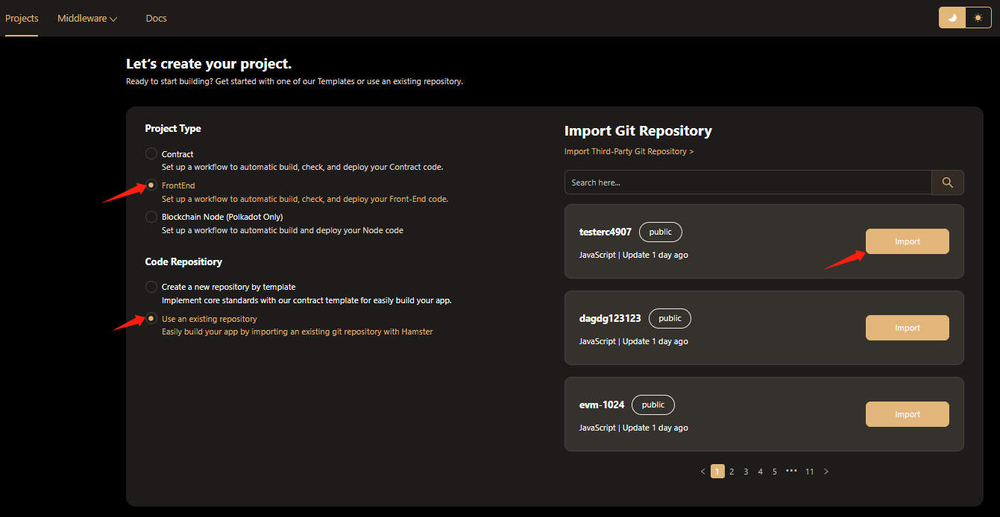
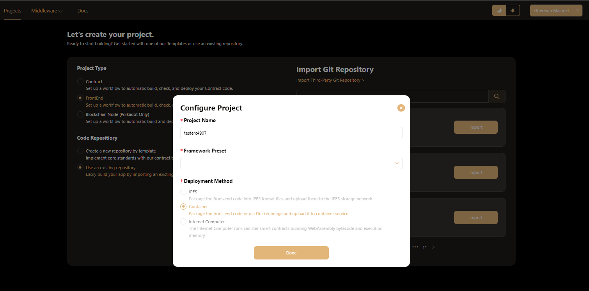
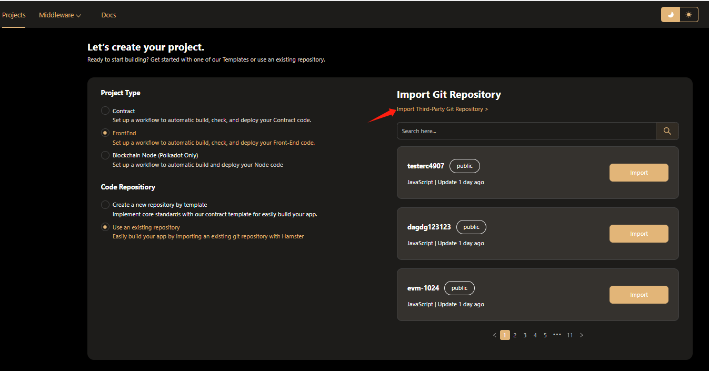
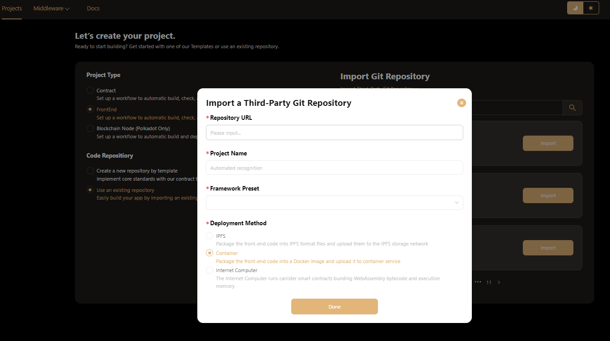

# Create Project for Front-End
You can create a new project from the Hamster **project list** page by clicking on the **Create Project** button.

## Create Front-End Project with Template

### Create Front-End with IPFS 

After going to the **Create Project** page，fill in the basic infomation of your own project first.

1. Select **contract item** of project type, the best practices workflow will be set up to assist you for completing project quickly.
2. Select **create a new repositiory by template item** of code repositiory to get started with one of our Front End templates.
3. Select **IPFS item** of Deployment Method to view our Front End templates.
4. Click the **template card** to go to the **template detail page**.

:::tip
About **popular template** area, Hamster will give you a collection of the most deployed templates.You can select one of these template, create your code repository to github quickly.
:::

On the ** template detail ** page，you can view detail info of the tamplate，include extensions, use cases & examples, resources, functions, events and After confirming that there is no problem with the template information, click the ** Create by template ** button to create project.

Click *View Demo* to view a sample template  

### Create Front-End with Container
1.Return to *Create Project* page  
2.Select **Container item** of Deployment Method to view our Front End templates.  

:::tip
You can also choose your favorite templates from the popular templates we provide to create your own projects
:::

### Create Front-End with IC（Internet Computer）
1.Also return to our *Create Project* page  
2.Select **Internet Computer item** of Deployment Method to view our Front End templates.  

:::tip
As above, you can choose some popular templates in Internet Computer to create your front-end project
:::  
## Create Front-End Project Import Git Repository
If you don't want to use the popular templates we provide or want to create your own unique templates on hamster, hamster also provides the function of one-click creation of projects through remote git repositories.  
### Create Front-End Project Import Github

1.Also return to the *Create Project* page  
2.After selecting the *FrontEnd* option, select the **Use an existing repository option** in the Code Repository option. At this time, you can view all public repositories of the currently linked github account.  
3.Select the code repository in github where the project needs to be created and click the *Import* button  

:::tip
Before creating a project with one click, you need to select the framework to which the code repository belongs and the method you need to deploy it.
:::  
### Create Front-End Project Import Third-Party Git Repository
Of course, if you want someone else's code repository to create your project, hamster can do the same. You only need to provide the github repository address of the other party's repository.  
  
As with the above operation, you only need to click the words **Import Third-Party Git Repository** on the **Create Project** page  

:::tip
In addition to the provided github address link, you also need to select the framework to which the code base belongs and the deployment method you need to use to create the project with one click.
:::  
