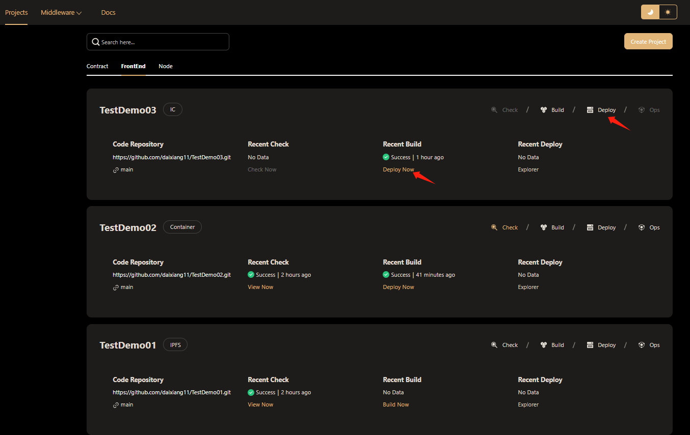
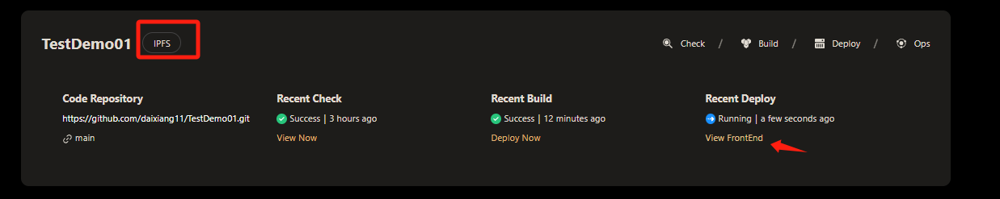
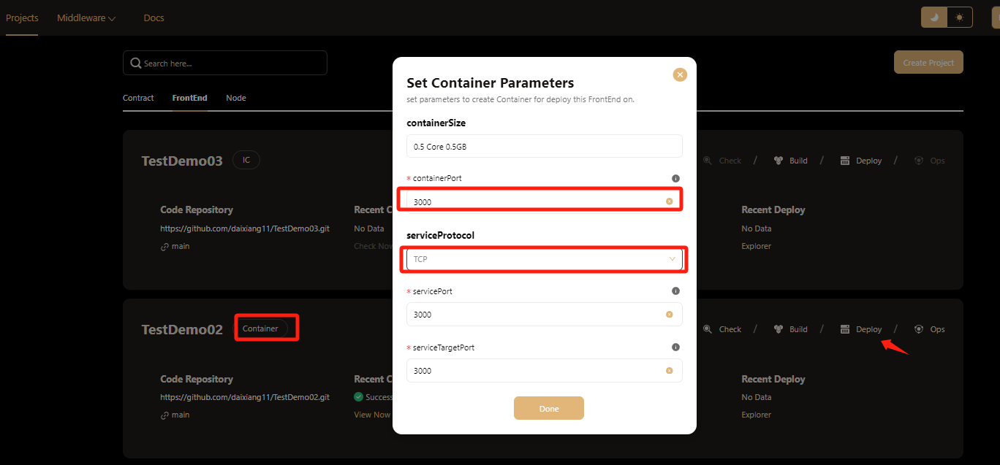
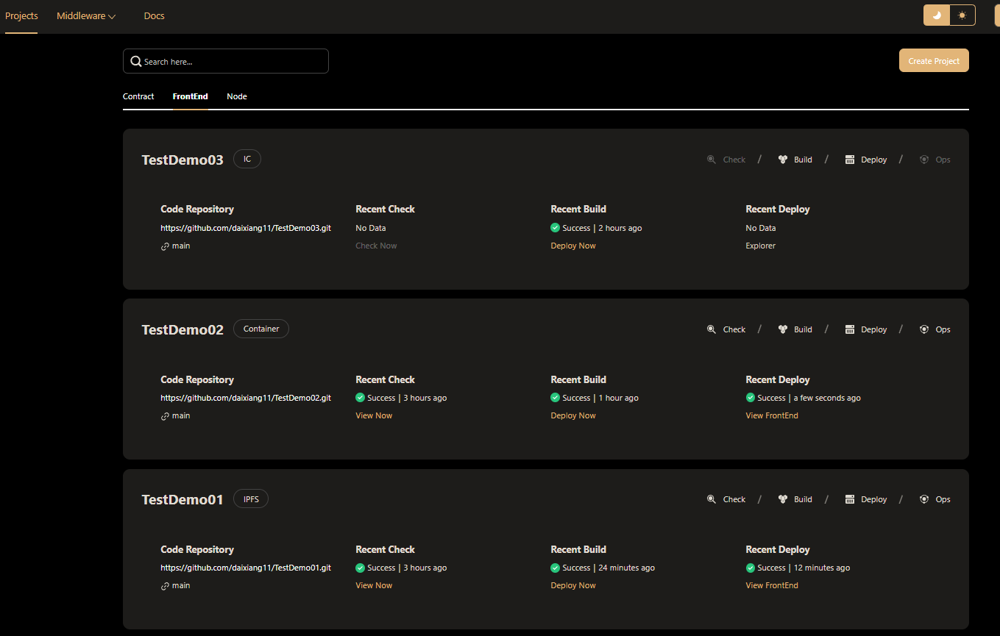
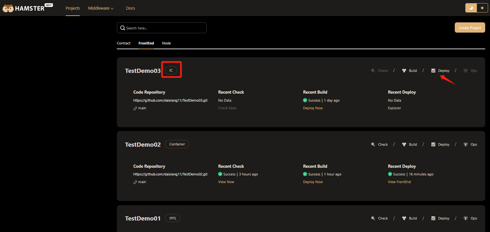
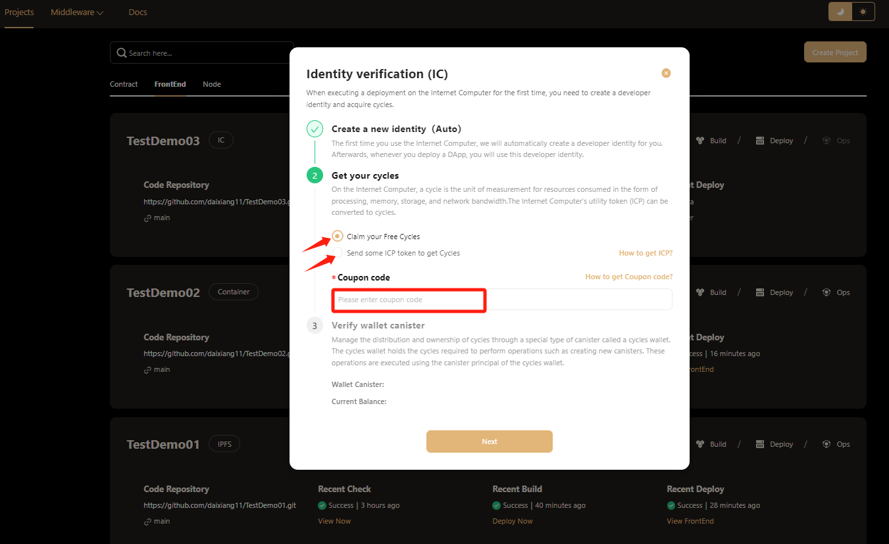
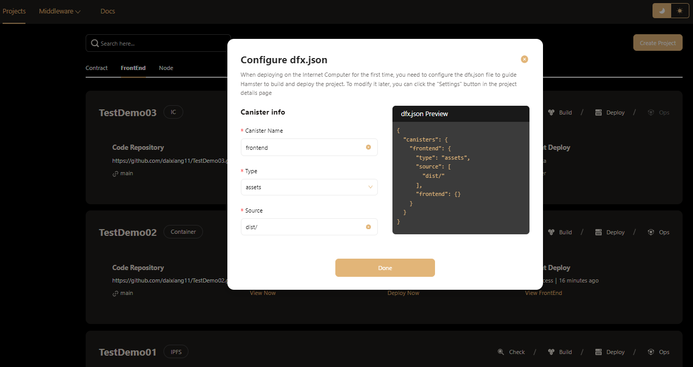
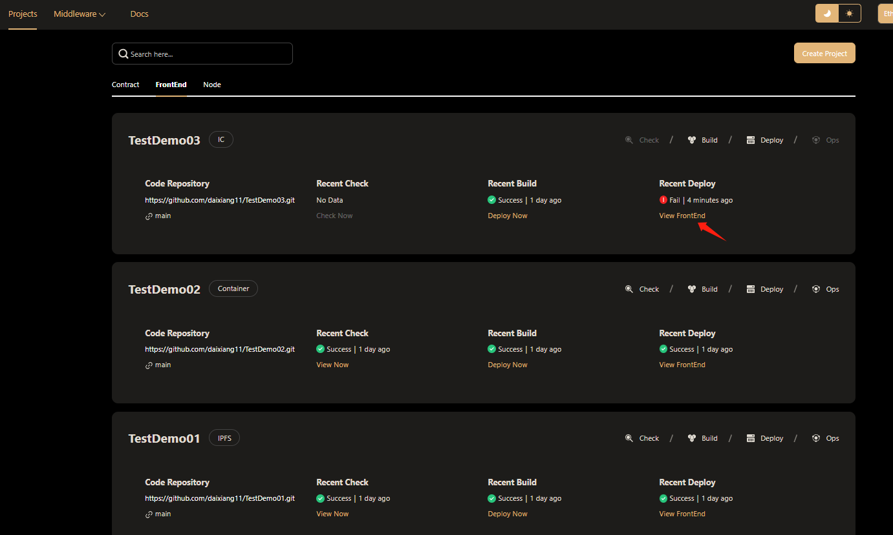
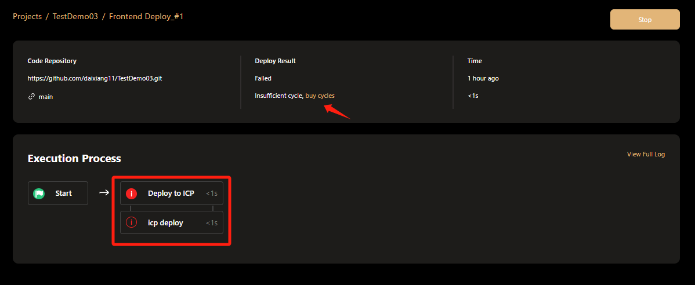
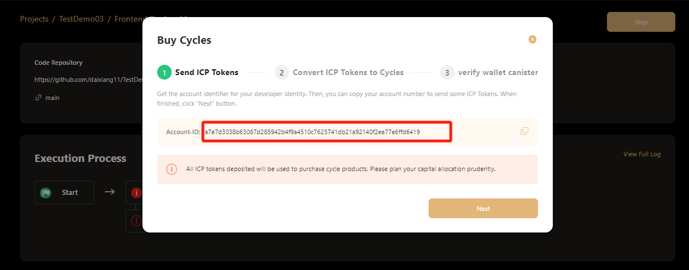

# Deploy Front-End Code
After Hamster completes building the front-end project, you can also deploy the project through Hamster.  
Click the "Deploy" button in the front-end project card to deploy the newly created front-end project.  

## Deploy Front-End on IPFS 
When we choose the deployment method of IPFS, we only need to click the **Deploy Now** button and hamster will automatically deploy it.

## Deploy Front-End on Container
When we choose the **Container** deployment method to deploy, click the **Deploy Now** button hamster to pop up a pop-up page.  

You need to set the port number for deployment and the protocol to be selected, and then you can perform one-click deployment.  

## Deploy Front-End on IC（Internet Computer）
The main difference when choosing **IC** deployment is that you need to provide an **IC** account and add a configuration file  

But don't worry, hamster will automatically check your account configuration. If there is no , hamster it will generate an account with one click. You only need to recharge the account through your wallet.  

If you have an IC coupon code, hamster also provides redemption and recharge services.  
[Want to know how to redeem IC coupons](https://internetcomputer.org/docs/current/developer-docs/setup/cycles/cycles-faucet)

After the account is successfully created, you still need to add a configuration file. Hamster can also add file configuration for you with one click. You can also customize the file in the options.  

When your IC account balance is insufficient to pay for the deployment of IC services, Hamster will prompt that one-click deployment failed.  
At this point, you can click the **View FrontEnd** button to go to the project details page to view the reason for the failure.  

If the deployment fails due to insufficient balance, you can click the **buy cycles** button to recharge.  

You can recharge the account according to the provided **Account ID** to complete the deployment
