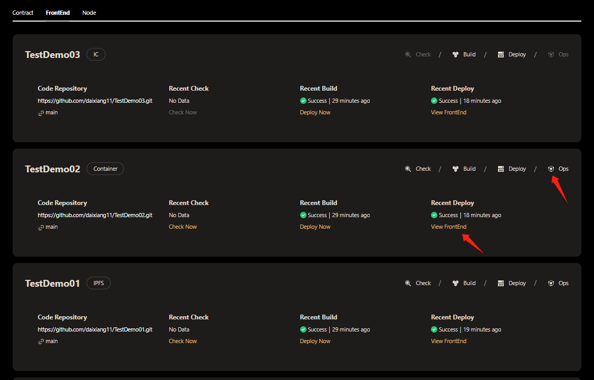
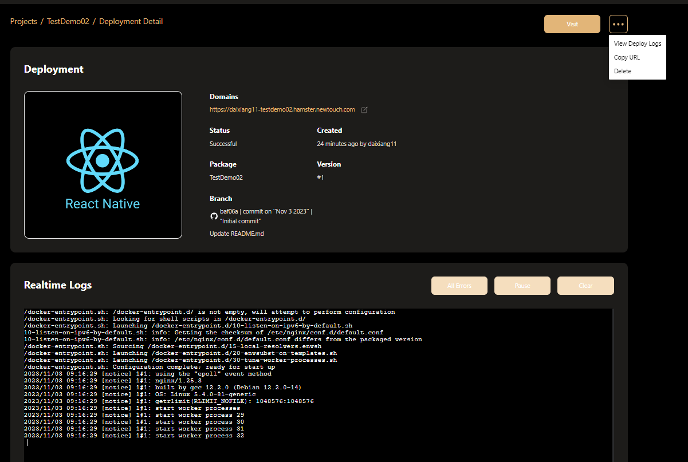
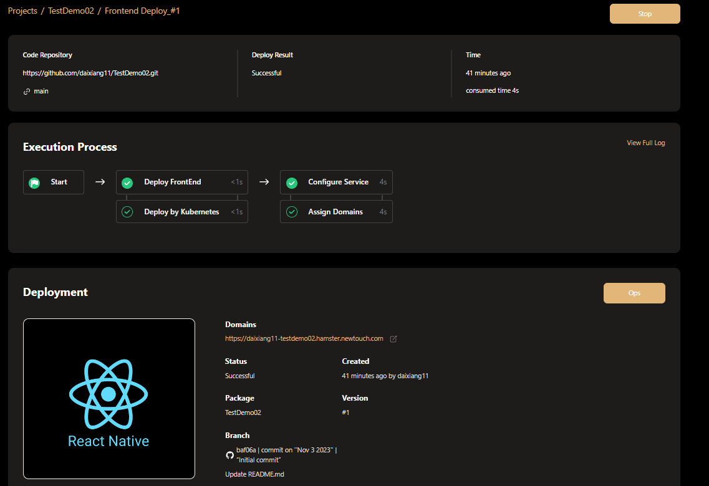

# Exploring Front-End Project
You can extract some information about the Hamster deployment front-end project in Explorer.
   
- Click the **ops** or **view FrontEnd** button to enter and view the deployment details.  

Go to the **Deployment Detail** page and you can see the deployment details and logs.

In addition to displaying necessary deployment information, provide the following operations
- 1.Click **Visit** or **Copy URL** to view the display template of the front-end project  
- 2.Click **View Deploy Logs** selection to jump to the deployment details page to view workflow details  
- 3.Click **delete** button delete currently deployed projects  

Click the **ops** button to return to the **Deployment Detail** page