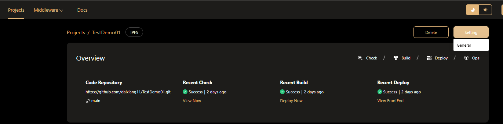

# Manage Front-End Project
To view all information about a project, select a project on the front-end project list page and click the project name to enter the project details page.  

Then, you can get a lot of information about this project, including workflows and artifacts from the Project Detail page.  
## View Workflow
Different types of projects will be configured with different workflows：
- The workflow for contract project includes contract checking and contract building. 
- The workflow for front-end project includes: front-end code checking, front-end code building, and front-end code deployment.

All executed workflows of the project can be viewed in the workflow area, including the workflow being executed and the historical execution records.  

In this area，you can do：
- Filter out the workflow of the specified type by the drop-down selection box at the top right.
- Click the **Details** button to view the details of the corresponding workflow.
- Click the **Delete** button to delete the corresponding workflow record.  
## View Artifacts
All artifacts generated on Hamsters of the project will be displayed in the artifacts area:
- The main artifacts of a contract project are contracts and contract check reports.
- The main artifacts of a Front-End project are Front-End package and front-end code check reports.  
### View Artifacts Package  

In the Artifacts area, click the Package tab to view the latest deployment information of the project, and click the **View** button to view the deployment details.  
### View Artifacts Reports
In the **Artifacts** area, click the **Reports** tab to view all the contract check report.  

In this area，you can do：
- Click the **View Report** button to view the detail infomation of this report.  

## Setup Project  
To edit project settings, choose a project from the project list, then, click the Setting button.

### Setting with IPFS

- The project selected for IPFS deployment only has **general** settings, which are used to change the project name.  
### Setting with Container  
  
- In addition to the **general** settings, the project selected for **Container** deployment also has container settings, which are used to configure the port number and other information of the container.  

