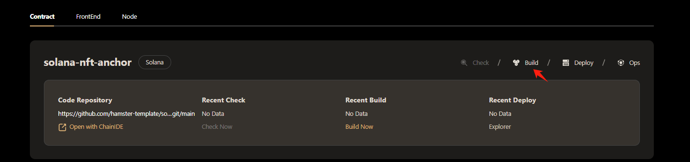
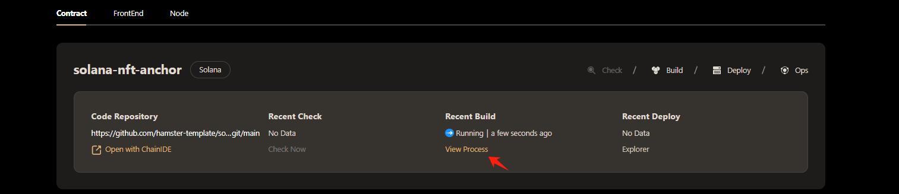
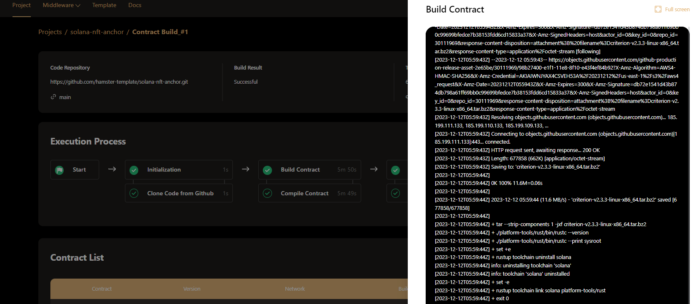
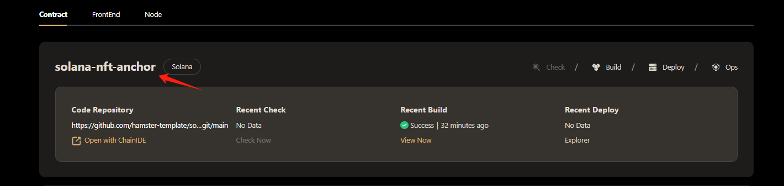
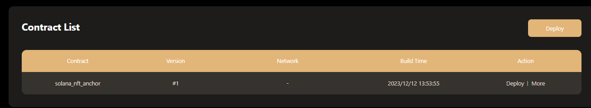

# Build Solana Contract  
Turn the hassle of compiling smart contracts into a simple submit-the-link task. One click to auto compile, efficient and convenient, with auto version control and code tracking.

With this Feature you will get:

🌟 **Simple and convenient** - No need to submit code, just submit the repository link to complete the compilation

🌟 **Directly compile version controlled code** - Support automatic pulling and compiling from the code repository

🌟 **No local environment required** - Server side automated compilation, no need for users to configure local compilation environment

🌟 **Automatic version management** - Automatically manage contract versions during the build process for future code tracking 

:::tip
Now open **[hamsternet.io](https://develop.alpha.hamsternet.io/projects)** and follow the tutorial to operate.
:::

## Needs
You have created a solidity contract project on Hamster. 

To view the project creation guidelines, please click [here](Create%20Project%20for%20Solana.md).  

## Execute Building
click the Build button in the contract project card, to build the contract.

When the building workflow is being executed, click the View Process button to view the process.  

## View Execution Process  
Hamster show the Execution Process by visual pipeline, You can see all built-in work nodes and the time each one takes.  
  
Click each work node，you can see the Execution log of this work node. Like this:  
  
## View Contract Artifact
To view contract artifact, choose a project from the project list, then, click the project name to go to the project detail page.  

You can Find the latest build workflow in the workflows area of project detail page. Click the Detail button to go to the build detail page.  

Then，you can find the contracts of this build workflow.  
  
After the build is completed, you can click the **Deploy** button for one-click deployment, or you can click the **More** button to download the built api file.  
:::tip About Contract Version, When the contract building is completed, the hamster will automatically add the contract version number+1. :::