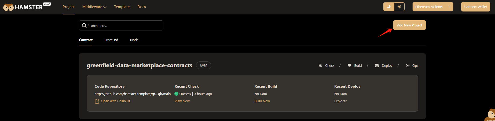

# Create Project for Solana
## hamster Templates
If you don’t have a suitable Solana contract, Hamster provides you with some reference templates  

You can enter the solana template display page according to the prompts above.  

Click on the project information to view contract details  

You can view the source code files of the contract and the contract methods that can be called externally.  
If you want to use the contract template provided by hamster to create a project, you can click the **Download** button to download it locally, and then push it to your personal github public repository to create your own project  
## Add New Project

Click the **Add New Project** button to enter the add project page. You can create a project directly through an authorized github repository or through a URL link.  

### Import Git Repository
Note:   
- If you use the template passed by Hamster to create the Solana project, you can create it directly. If you want to use your own contract to create it, you need to understand the following points  
1. Hamster currently only supports contract deployment of the anchor framework. The contract project you need to create must be created using the anchor framework. 
2. Before creating a project, you need to add a configuration file to the root directory of your project to create a local wallet account to help you complete contract deployment.  
3. [Get hamster_solana configuration file](https://github.com/hamster-template/solana_script.git)
- If you have a Github account and authorize hamster to view your warehouse code, you only need to perform a few operations  

1. Select the authorized Github account, select the solana contract warehouse you need to create, and click the import button  
2. Select Solana Ecosystem in the **Affiliated Ecosystem** option in the pop-up window 
3. Click the **Done** button to create a project for you with one click  
- If you need to use a third-party warehouse that Hamster is not authorized to read, you can click on the word **import Third-Party Git Repository** to perform the following operations  
  
1. Copy your git url via ssh link and paste it into the **Repository URL** input box  
2. Select solana ecology in the **Affiliated Ecosystem** input box  
3. Click the **Done** button to create a project for you with one click  
  
At this point, your solana project has been created. Click **Back to project list** to jump to the project page to view it.  
