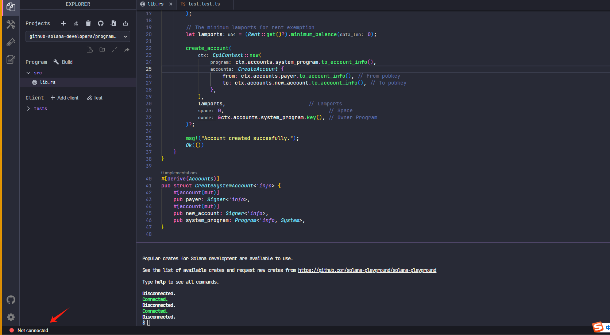
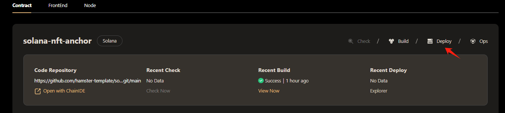
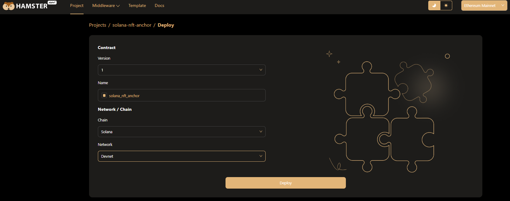

# Deploy Solana Contract  
## Connect Wallet  
The deployment of Hamster smart contract is currently limited to the *phantom* wallet only, but we plan to integrate with other mainstream wallets soon to provide users with more options.

After entering the contract deployment page, if you have not yet installed the *phantom* wallet browser plugin, we will guide you through the installation steps. Once installed, you will find the *phantom* icon in your browser.

Click the icon to open the wallet. If you do not have an *phantom* account, you can create a password to protect your account security. This password will be verified whenever you send a transaction or purchase cryptocurrencies, so please remember the password you set. After reading and agreeing to *phantom* terms and privacy policy, you can start using the *phantom* wallet.  
## Claim Test Coins  
You can receive some test coins for deployment in the solana IDE tool  
Go to [Solana IDE](https://beta.solpg.io) to get test coins  

You can click on the wallet link and choose to log in to your wallet account  
Then enter the command in the terminal and enter the following command line to receive the test coins  
> solana airdrop 5  
## Deploy Contract  
Once Hamster has completed building the smart contract, you can deploy it through Hamster. Click the Deploy button on the contract project card to deploy the newly built contract.  
  
After entering the "Contract Deployment" page, please link your wallet, then enter the basic information required for deployment, including contract version, contract name and target network/chain.  
  
Once you have confirmed the deployment information, click the Deploy button. Hamster will invoke the wallet plugin to confirm the deployment transaction. After the contract deployment is completed, it will automatically jump to the contract's Dashboard page. On this page, you can check the status of your contract.  
:::tip About Contract Version, When the contract building is completed, the hamster will automatically add the contract version number + 1. :::  
