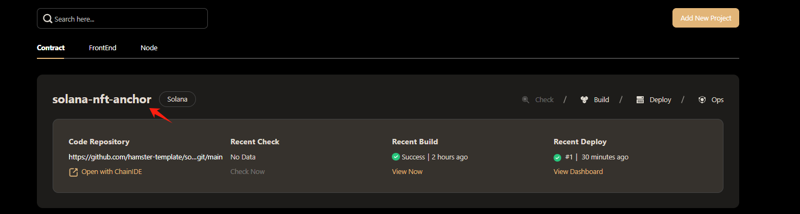
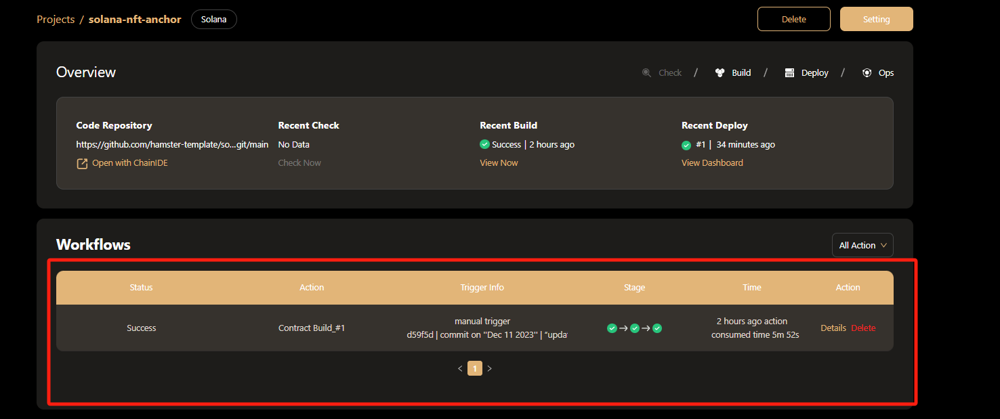
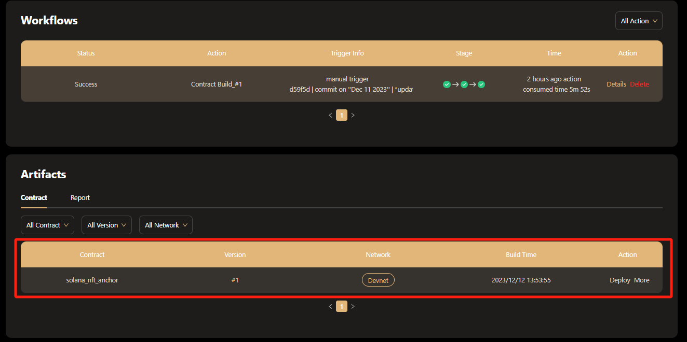
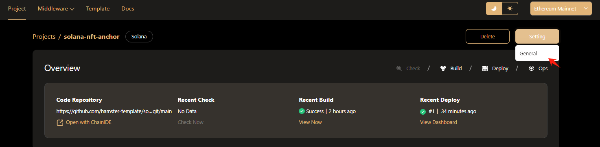
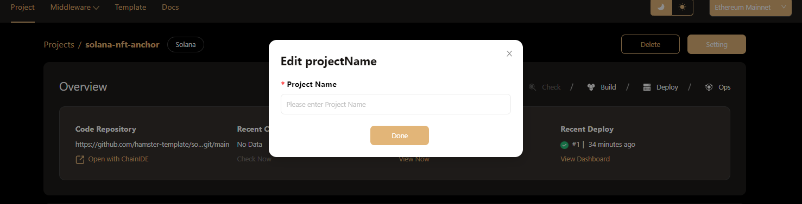

# Manage Project  
To view the details of a project, choose a project from the project list page and click the project name to go to the Project Detail page. There, you can get extensive information about the project, including its workflows and artifacts.

  
## View Workflows  
Projects of different types have different workflows configured:  
- Contract projects: Contract checking and building.  
- Front-end projects: Front-end code checking, building and deployment.  
You can view all executed workflows of a project in the Workflow area, including the currently running workflow and historical execution records.  
  
In this area, you can:  
- Filter workflows by type using the dropdown at the top right.  
- View workflow details by clicking the **Details** button.  
- Delete a workflow record by clicking the **Delete** button.  
## View Artifacts  
All project artifacts generated on Hamster are displayed in the Artifacts area:  
- Contract projects: Contracts and contract check reports.  
- Front-end projects: Front-end packages/images and code check reports.  
## View Contract Artifacts  
In the Artifacts area, click Contracts to view all contracts built by Hamster and their deployments on Solana chain.  
  
Here, you can:  
- Filter contracts by using the dropdown.  
- Deploy a contract by clicking **Deploy**.  
- Once deployed, explore a contract in detail by clicking **More** > **View Dashboard**.  
- Download a contract's ABI by clicking **More** > **Download ABI**  
## General Settings  
To edit project settings, go to **Setting > General** on the project detail page.  
  
There, you can change the project name on the Edit Project Name popup.  
  
