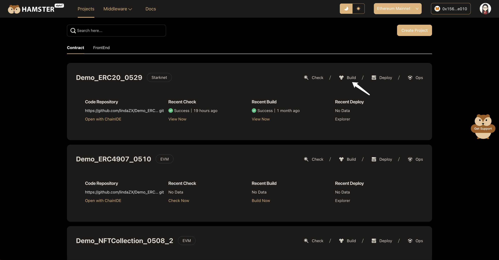
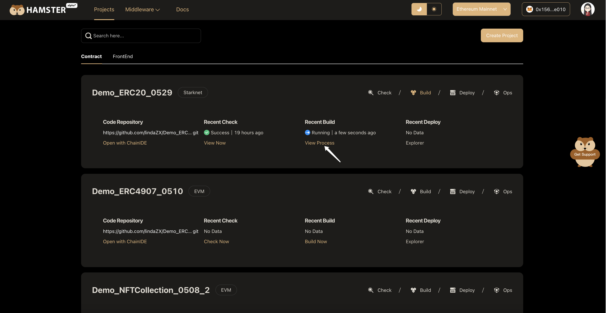
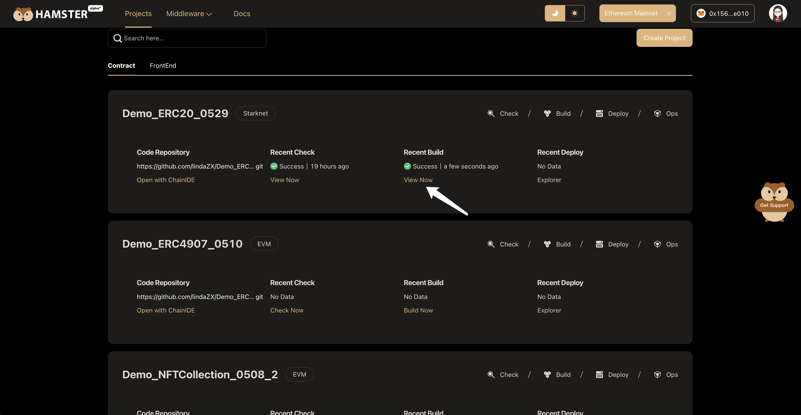
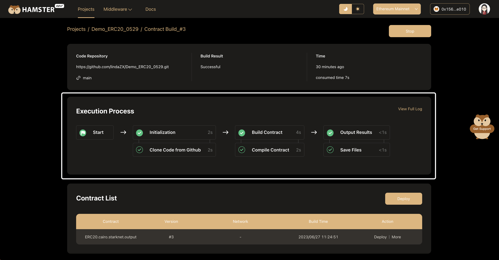
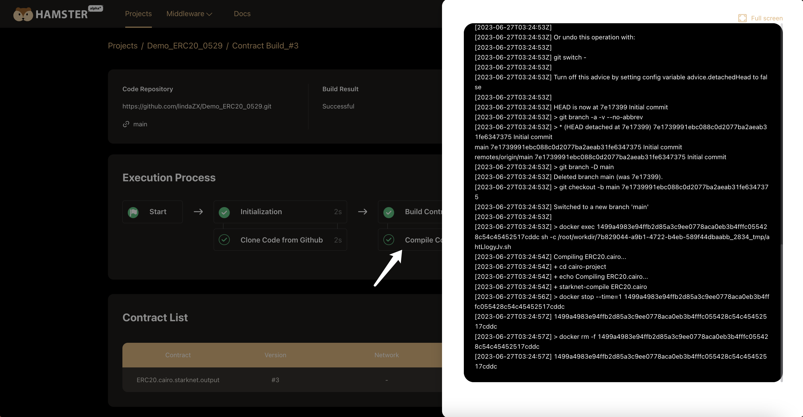
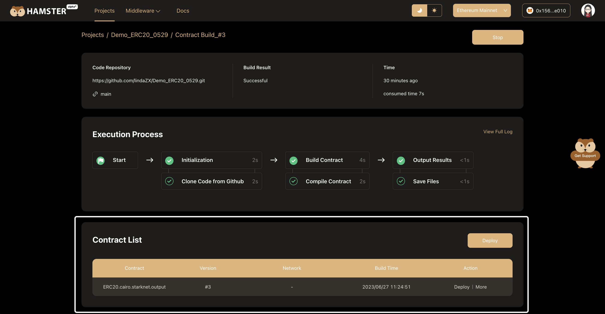
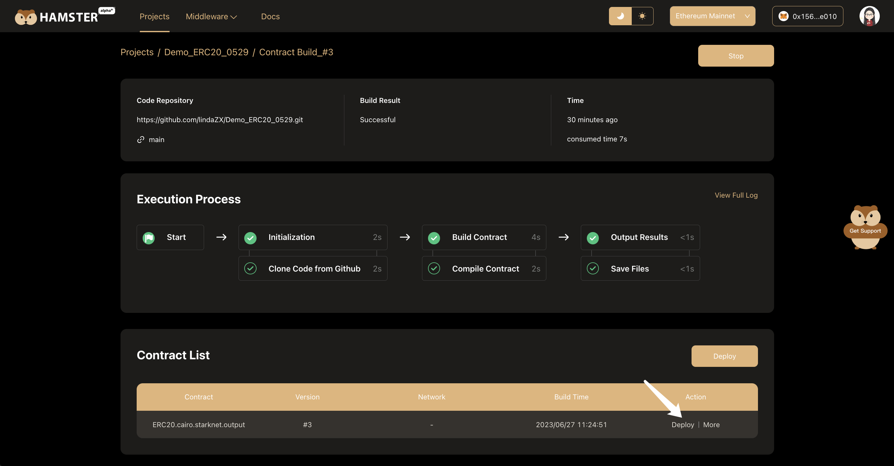
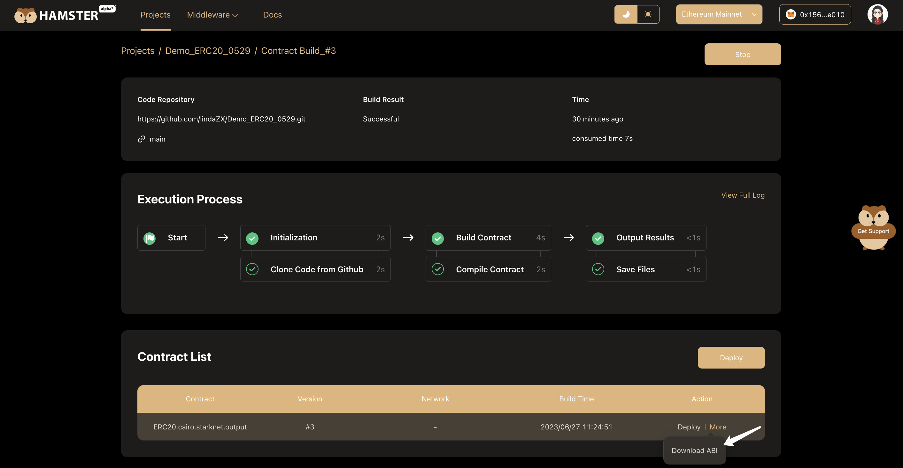

# Build Contract

One-click update, instant build. Commit code to GitHub, click to build, Hamster takes over seamlessly. The intelligent system requires no manual intervention and development does not stop. Intelligent processes unleash creativity and allow ideas to take shape quickly.

## Execute Building

To build your contract, click **Build** on the **Contract Project** card.

While the build workflow is in progress, click the **View Process** button to monitor the process.

Once the build workflow is complete, click the **View Now** button to view the generated smart contract.

## View Execution Process

Hamster visually depicts the build workflow through an intuitive pipeline view. You can see all the built-in workflow nodes and the time each step takes. 

Click on any workflow node to view its execution log details. For example:

## View Contract Artifact

After the building is completed, the Contract List will be automatically displayed below the "Execution Process" area. Like this:

Want to deploy this contract quickly? Click "Deploy" to enter the contract deployment page.

## Download ABI File

After the contract is deployed, click "Download ABI" to get the ABI file of the contract.

 The ABI file defines the interface of the contract and allows other applications to interact with it. 
You can use the ABI file in the following scenarios:
- DApp calls contract methods: DApps can understand the methods and parameters exposed by the contract through the ABI file to call the contract.
- Generate web3.js contract object: The ABI file can be used to generate a web3.js contract object to easily call the contract using JavaScript. 
- Verify transaction data: The ABI file defines the format of parameters for each method and can be used to verify the parameters passed in when calling the contract method.
- Debug smart contracts: The ABI can be used to infer which method a transaction is calling to aid in contract debugging.
- Generate signatures: The ABI is needed to construct the data of transactions that call contracts in order to sign them.

In short, the ABI file allows other applications to interact seamlessly with your smart contract. Download the ABI and maximize the value of your contract!
