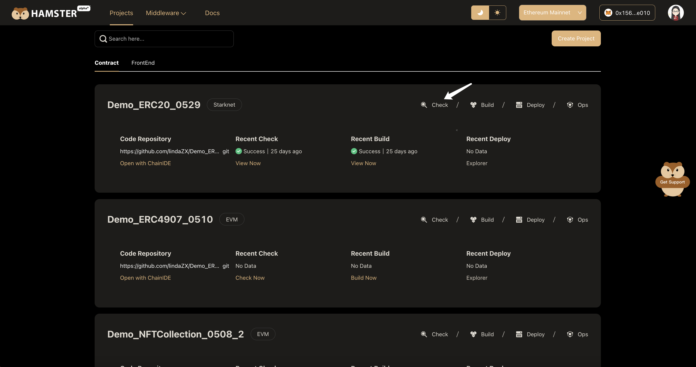
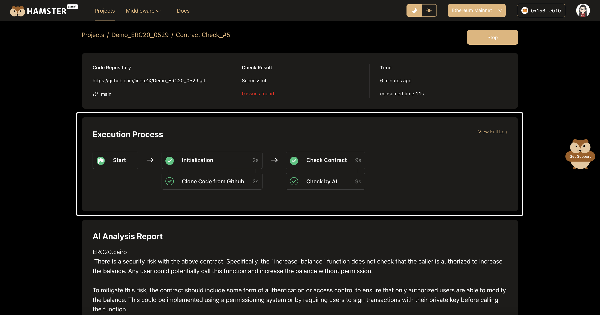
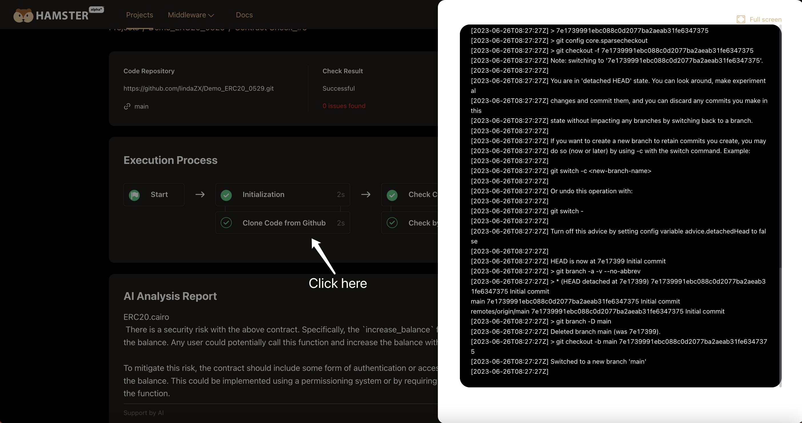
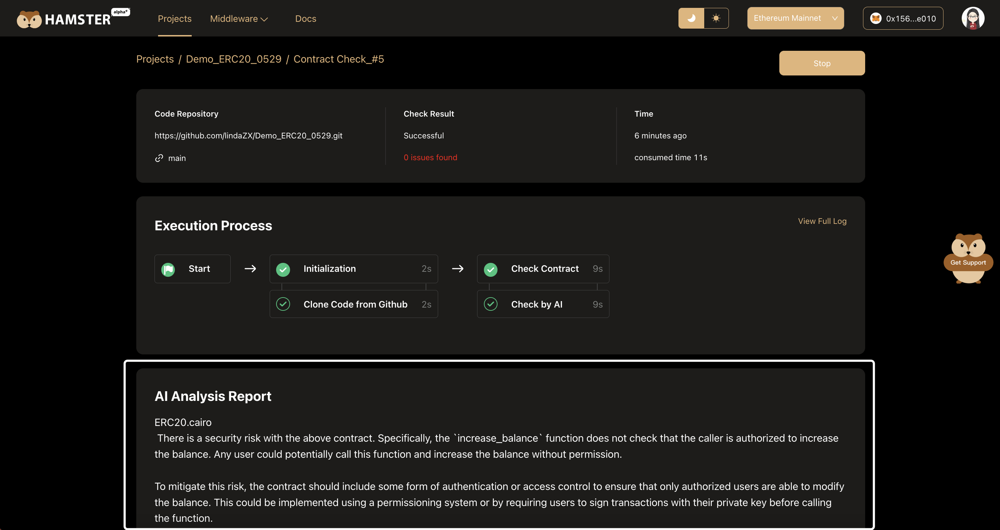

# Check Contract

Hamster will conduct all-round inspections on smart contracts, including security analysis, contract style specification inspection. 

The Execution process is automatic without manual intervention.

## Execute Checking

Click the **Check button** in the **contract project card**, to check the contract.

When the checking workflow is being executed, click the **View Process button** to view the process.

When the checking workflow is completed, click the **View Now button** to view the checking report.

## View Execution Process

Hamster show the Execution Process by visual pipeline, You can see all built-in work nodes and the time each one takes. 

Click each work node，you can see the Execution log of this work node. Like this:

## View AI Analysis Report

After the checking is completed, the AI Analysis report will be automatically displayed below the "Execution Process" area. Like this:

All contract code files with problems in the project will be displayed in this area. You can optimize and improve the smart contract based on the AI Analysis report.

## Next,...
Hamster has always put the security of Starknet smart contracts first. 

We currently use AI technology to fully detect potential security vulnerabilities in contracts. In the future, we will also introduce top audit companies and open source tools in the industry to fully guarantee security. 

Users can safely develop and call Starknet smart contracts on Hamster. We will do our best to ensure that every line of code can stand security audits.

