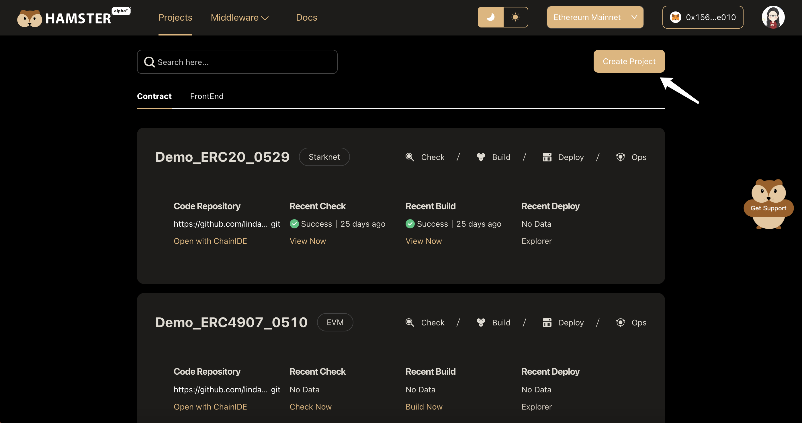
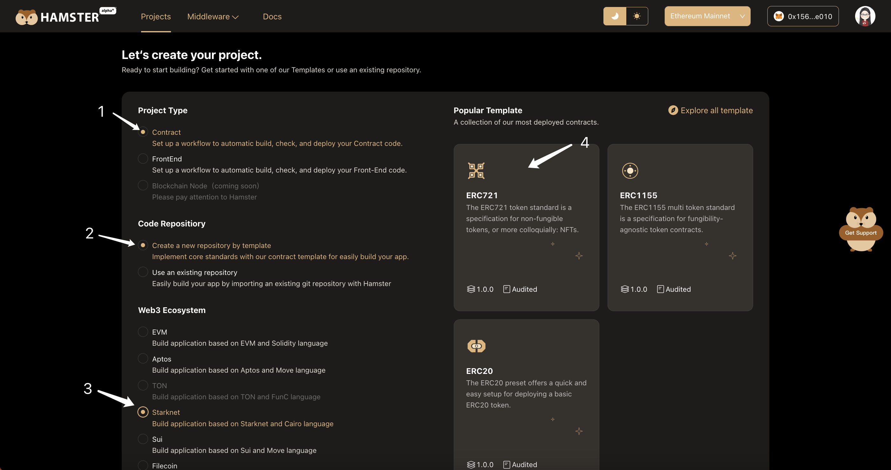
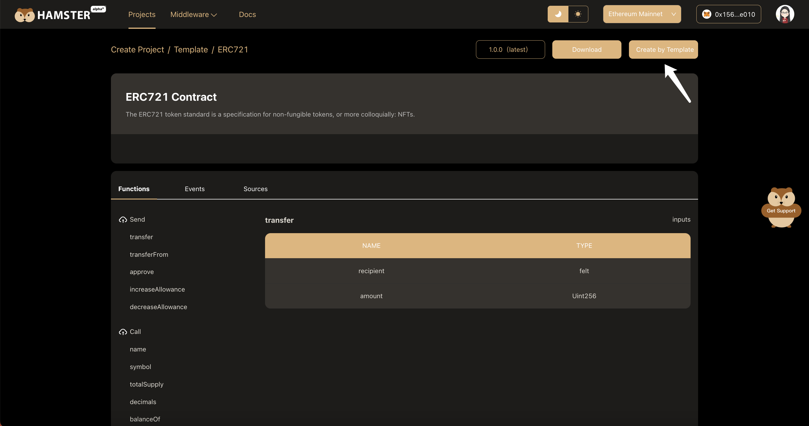
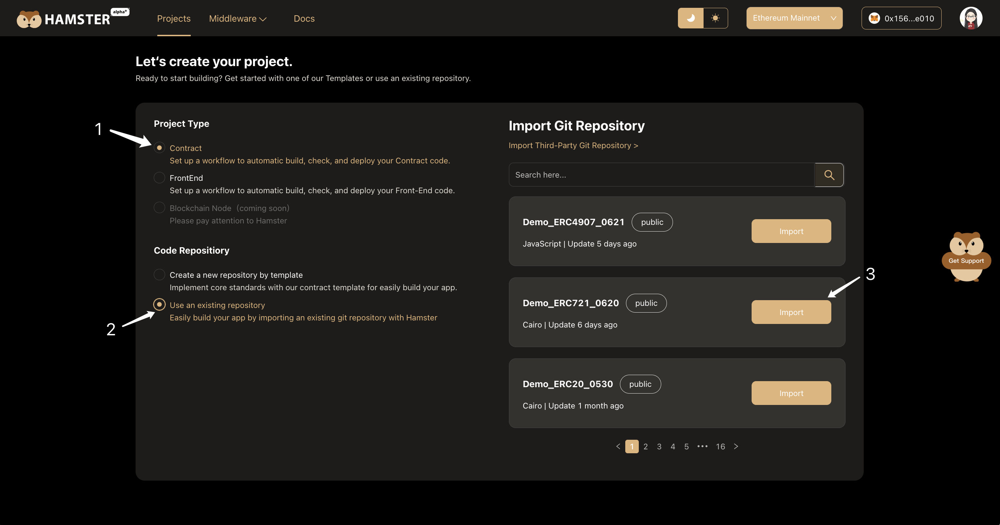
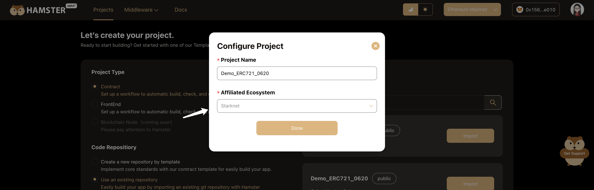

# Create Contract Project

After creating a project with one click on Hamster, Hamster will establish a strong cooperative relationship with the project. 

Subsequently, all inspection, building and deployment work will be fully undertaken by Hamster's intelligent system, allowing you to focus entirely on business creativity and core development.

## Create Contract Project with Template

You can create a new project from the Hamster **project list** page by clicking on the **Create Project** button.

After going to the **Create Project** page，fill in the basic infomation of your own project first.

1. Select **contract item** of project type, the best practices workflow will be set up to assist you for completing project quickly.
2. Select **create a new repositiory by template item** of code repositiory to get started with one of our contract templates.
3. Select **Starknet item** of Web3 Ecosystem to view our starknet templates.
4. Click the **template card** to go to the **template detail page**.

Hamster currently includes 3 Starknet contract templates to allow developers to quickly build contracts:

- ERC721 - Non-fungible token standard contract template, which can be used to issue a unique set of tokens.
- ERC1155 - Multi-token standard contract template, which can be used to issue different types of tokens.
- ERC20 - Fungible token standard contract template, which can be used to issue the same type of interchangeable tokens.

We warmly welcome community developers to propose more contract template needs or share high-quality contract templates. Let's work together to promote the development of the Starknet ecosystem.

 On the **template detail page**，you can view detail info of the tamplate，include functions, events and sources.

After confirming that there is no problem with the template information, click the ** Create by template ** button to create project.

:::tip
In the upper right corner of the  ** template detail ** page, you can choose the required template version according to the actual situation.
:::

After created successfully, return to the project list to view the newly created project.

## Create Contract Project with exisiting repository

You can create a new project from the Hamster **project list** page by clicking on the **Create Project** button.

After going to the **Create Project** page，fill in the basic infomation of your own project first.

1. Select **contract item** of project type, the best practices workflow will be set up to assist you for completing project quickly.
2. Select **Use an exisiting repository item** of code repositiory to view all authorized code repositories under your Git account
3. Click **Import button** to import the required repository.

After clicking the **Import button**, a pop-up window will appear for configuring the project. 

Select **Starknet Ecosystem** in the pop-up window, then click the **Done button** to create the project on Hamster. Hamster will automatically set up an appropriate automated workflow for the project. 

## Next, ...

At this point, your project on Hamster is fully integrated with GitHub. This means you can continue developing your project. You can do so in the normal development process.

After you push the code to the GitHub branch, you can check, build and deploy your contract with one click. Everything will become much simpler.