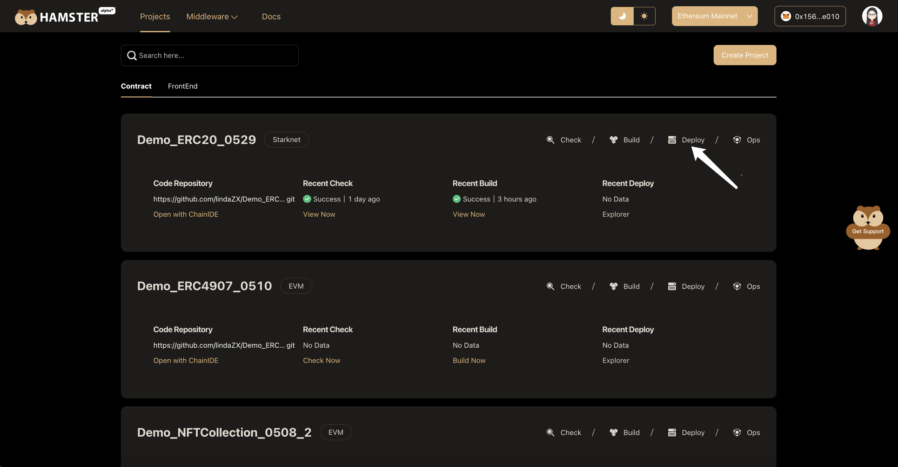
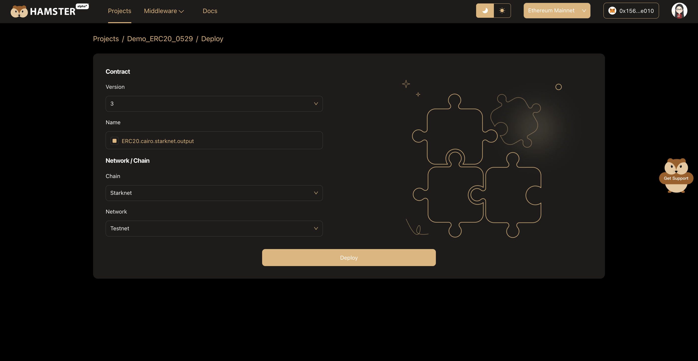

# Deploy Contract

## Connect Wallet

The deployment of Hamster smart contract is currently limited to the Argent X wallet only, but we plan to integrate with other mainstream wallets soon to provide users with more options.

After entering the contract deployment page, if you have not yet installed the Argent X wallet browser plugin, we will guide you through the installation steps. Once installed, you will find the Argent X icon in your browser. 

Click the icon to open the wallet. If you do not have an Argent X account, you can create a password to protect your account security. This password will be verified whenever you send a transaction or purchase cryptocurrencies, so please remember the password you set. After reading and agreeing to Argent X's terms and privacy policy, you can start using the Argent X wallet.

## Claim Test Coins

You can claim a small amount of free test tokens for transaction fees within the Starknet network.

Faucet：https://faucet.goerli.starknet.io/

## Deploy Contract

Once Hamster has completed building the smart contract, you can deploy it through Hamster. Click the **Deploy** button on the **contract project** card to deploy the newly built contract.

After entering the "Contract Deployment" page, please link your wallet, then enter the basic information required for deployment, including contract version, contract name and target network/chain.

Once you have confirmed the deployment information, click the **Deploy** button. Hamster will invoke the wallet plugin to confirm the deployment transaction. After the contract deployment is completed, it will automatically jump to the contract's Dashboard page. On this page, you can check the status of your contract.

:::tip
About **Contract Version**, When the contract building is completed, the hamster will automatically add the contract version number + 1.
:::

