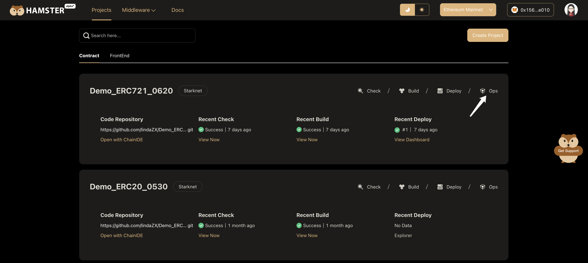
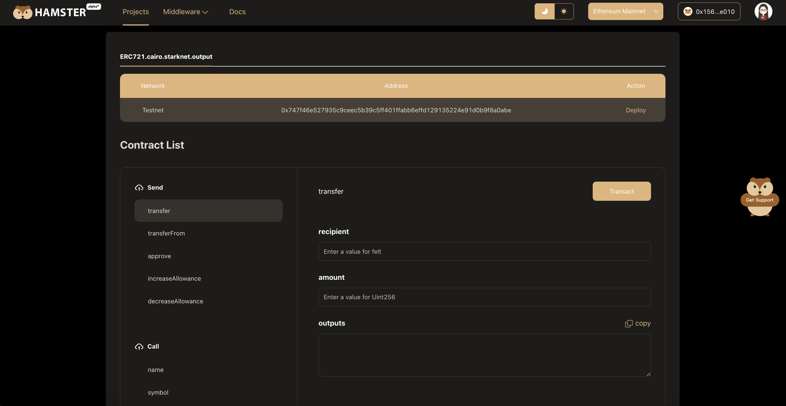

# Explore Contract

## Smart Contract Interaction

The contract interaction functionality provided by Hamster can be said to be a magic weapon for developer and user experience!

As a developer, you don't need to write any code. You can directly interact with your smart contract on the Hamster Dashboard page, call any public method and get the return value. This greatly simplifies the development process. You can quickly verify the functionality of the contract and debug possible problems.

If you are a beginner, Hamster is the best platform for you to understand and learn smart contracts. You can deploy sample contracts to interact with them, observe the actual changes on the blockchain, and experience the whole process of calling the contract. This will allow you to understand how blockchain smart contracts work as easily and pleasantly as playing a game.

To entering a Smart Contract view, you can click the **Ops** button on the **contract project** card from the **project list**.

On the **Contract Dashboard** page, you can seamlessly call methods on your deployed Smart Contract.

