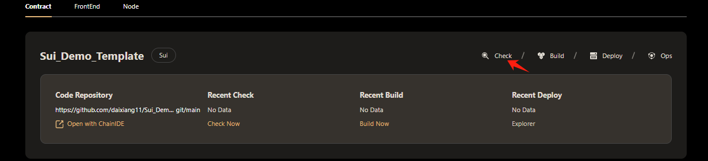
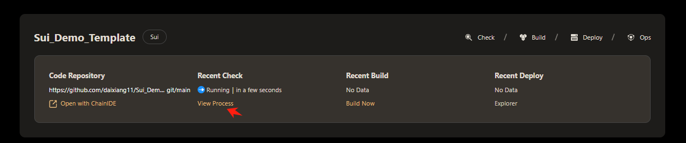
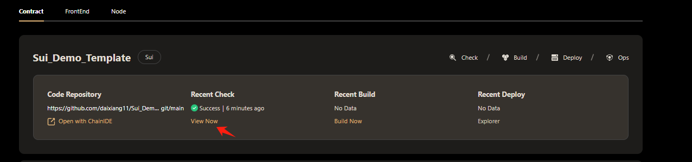
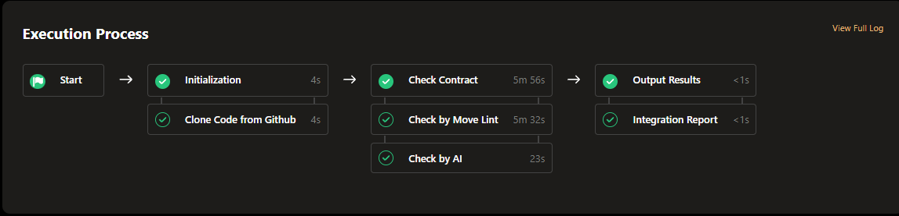
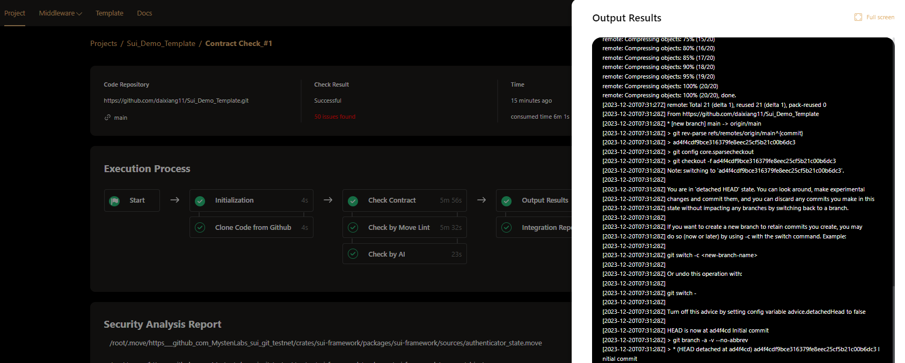
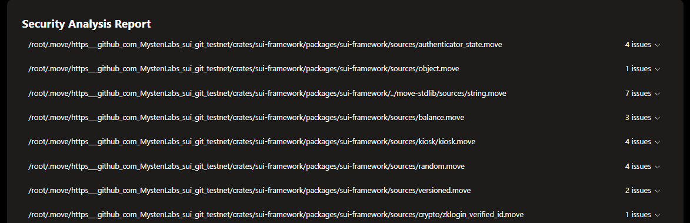
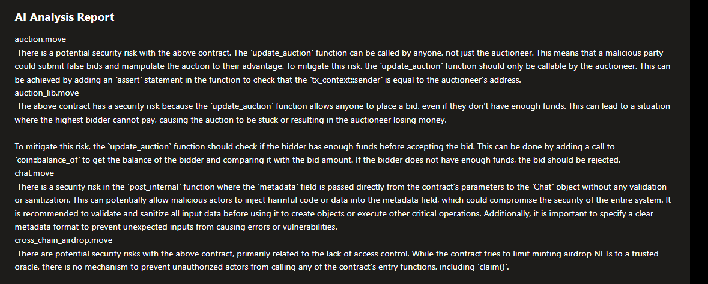

# Check Sui Contract  
Hamster will conduct all-round inspections on smart contracts, including security analysis, contract style specification inspection. The Execution process is automatic without manual intervention.  
## Execute Checking  
click the Check button in the contract project card, to check the contract.  
  
When the checking workflow is being executed, click the View Process button to view the process.
  
When the checking workflow is completed, click the View Result button to view the checking report.  
  
## View Execution Process  
Hamster currently provides two inspection tools *AI* and *Move lint* for the sui contract to check the security of the contract and the standardization of the code. Through the visual pipeline to display the execution process, you can see all built-in work nodes and The time spent on each worker node.  
  
Click each work node，you can see the Execution log of this work node. Like this:  
  
## Security Analysis Report  
After the contract check is successfully executed, the security analysis results will be displayed. Like this:  
  
All contract code files with problems in the project will be displayed in this area. Click the problems file name to display the problems, the content includes: the row and column where the problem occurred, the problem description, and the check tool.  

## AI Analysis Report  
Based on the report summary generated by the *AI* inspection tool, provide security analysis and summary for the created contract  
  

You can make corresponding changes to the contract based on the opinions and analysis given in the above inspection report to complete subsequent build and deployment.  
