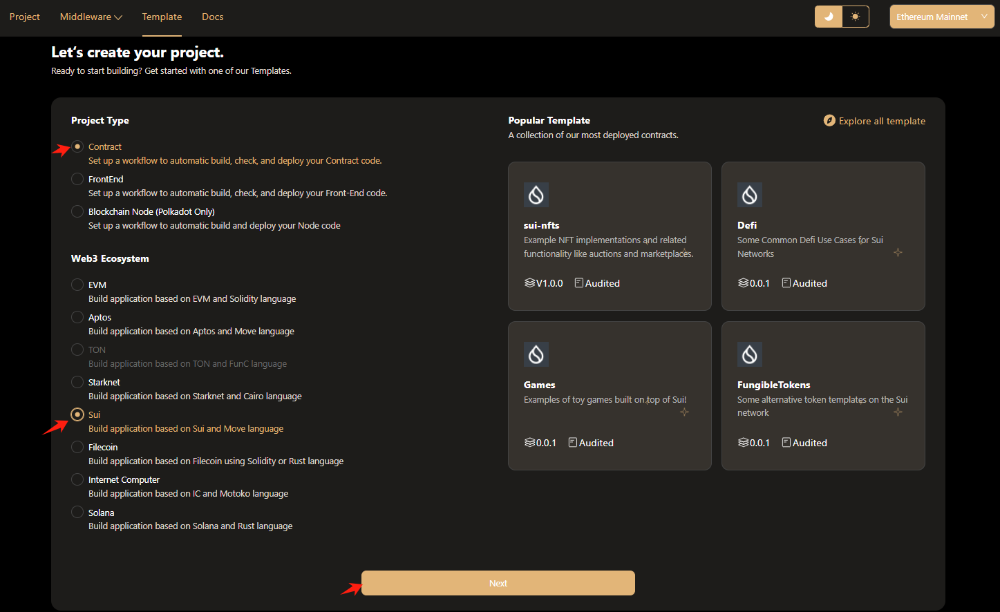
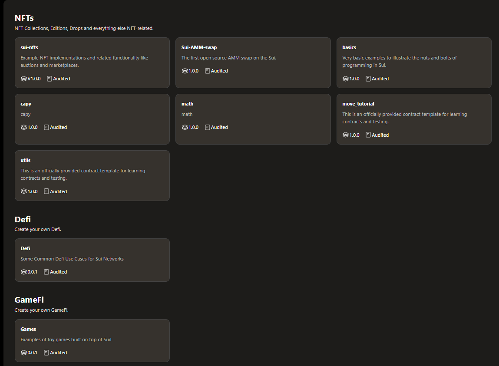
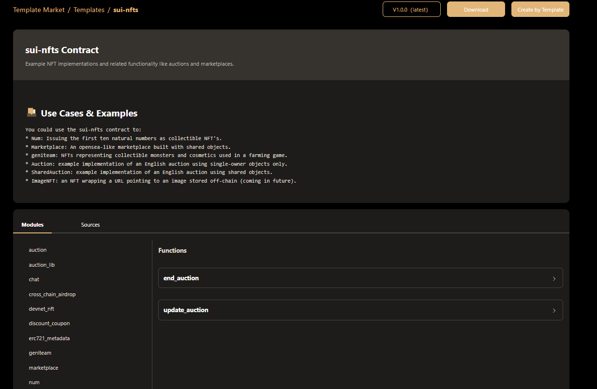
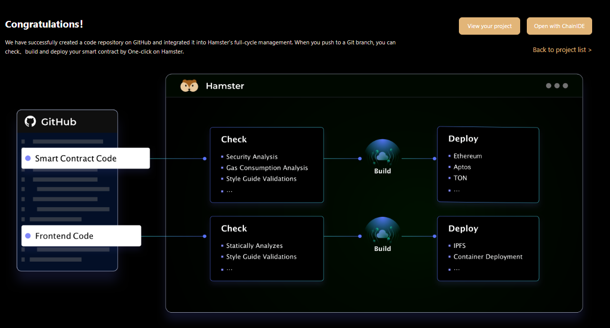
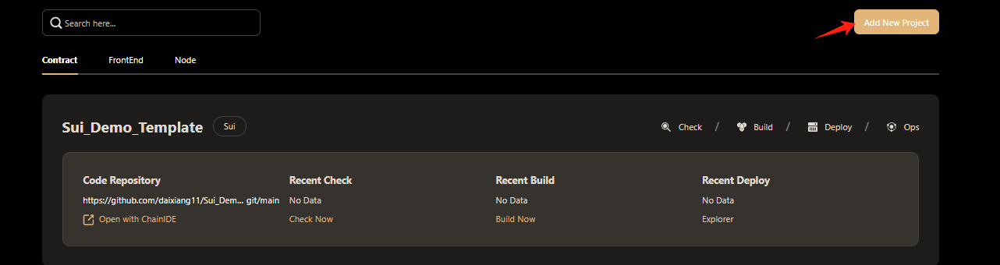
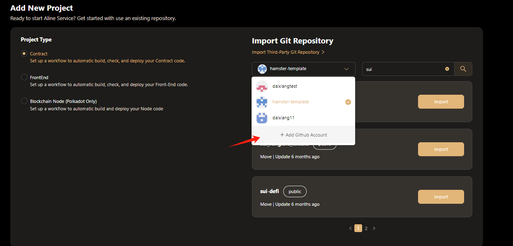
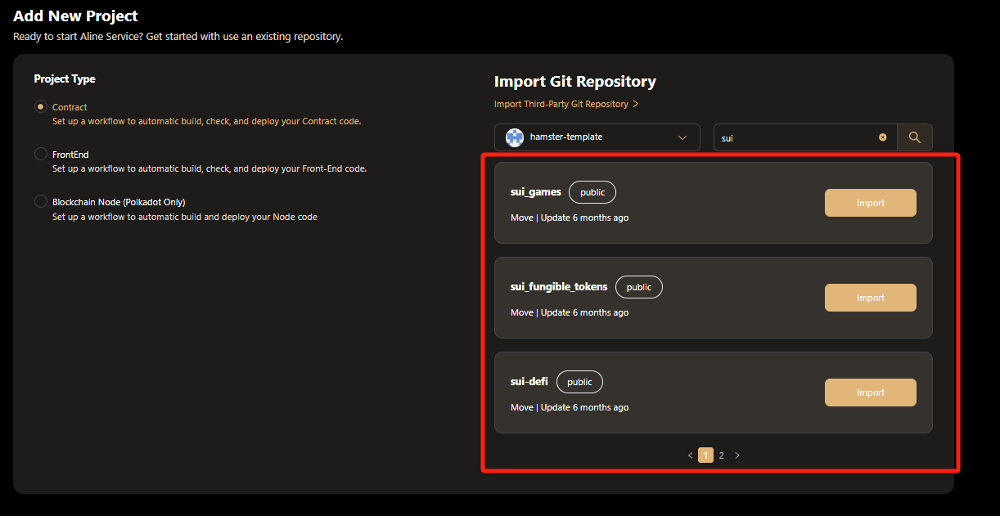
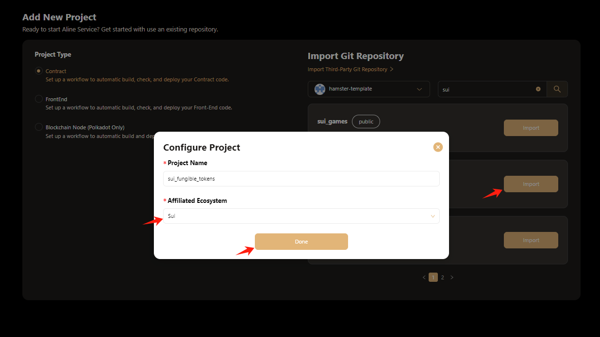

# Create Project for Sui 
## create for hamster Templates 
If you do not have a suitable sui contract, Hamster provides you with some reference templates to help you create project deployments for the sui ecosystem.  
  
You can choose your own contract template according to different contract types  
  
Click the selected project template to enter the project details page, where you can view the contract description, callable methods and source code  
  
After selecting the contract template, there are two ways to create the project  
- 1 Click the **Download** button to download the contract, manually add it to the GitHub repository, and create it through the url link  
- 2 Click the **Create by Template** button and you can first grant hamster the write permissions of your GitHub account, and then you can create a project for you with one click.  

  
After the project is successfully created, you can return to the hamster project management page according to the prompts, or you can go to the GitHub warehouse to view the project structure of the contract.  

## create for github
If you have your own contract project and need to deploy it on the sui public chain through hamster, you can do the following  
  
Click the Add New Project button to enter the add project page. You can create a project directly through an authorized github repository or through a URL link.
  
If your contract is stored in your own GitHub repository, you can first give hamster permission to read your GitHub repository, which will make it easier for you to create your own project with one click.  
 
After successful authorization, hamster will display the projects in your GitHub repository. Click **import** to complete the following two-step selection and create your own project with one click.  
-   
- 1 .Confirm the contract name of the created project and select the public chain to be deployed.  
- 2 .Click the **Done** button to create it for you with one click  

If the contract you deploy belongs to the warehouse of a third-party GitHub account, hamster provides a URL link to create the project for you.  
  
- 1 .According to the word **import Third-Party Git Repository** prompt, click to give pop-up options  
- 2 .Enter your contract URL link according to the pop-up window prompts, confirm the name of the project created by the number  
- 3 .Select the ecology that needs to be deployed and click the **** button to create your contract project with one click  
 
At this point, your solana project has been created. Click Back to project list to jump to the project page to view it.  
