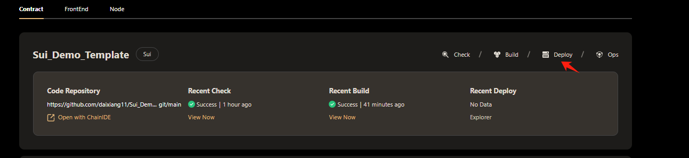
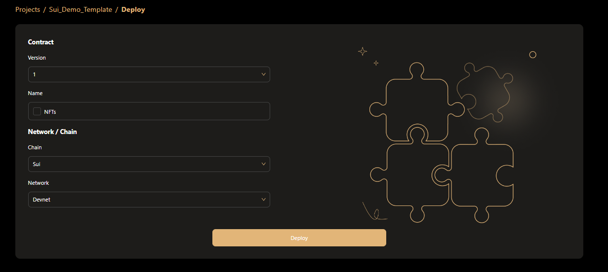

# Deploy Sui Contract  
When deploying the sui contract, hamster provides a graphical and concise one-click deployment operation, which is simpler and more convenient than the traditional method.  
## Needs  
1.Your browser needs to install a plug-in that supports sui wallet transactions  
2.[Your project needs to be built and the build generated](Build%20Contract.md)  

## Deploy Contract  
Once Hamster has completed building the smart contract, you can deploy it through Hamster. Click the Deploy button on the contract project card to deploy the newly built contract.  
  
After entering the "Contract Deployment" page, please link your wallet, then enter the basic information required for deployment, including contract version, contract name and target network/chain.  
  
Once you have confirmed the deployment information, click the Deploy button. Hamster will invoke the wallet plugin to confirm the deployment transaction. After the contract deployment is completed, it will automatically jump to the contract's Dashboard page. On this page, you can check the status of your contract.  

::tip About Contract Version, When the contract building is completed, the hamster will automatically add the contract version number + 1. :::  
