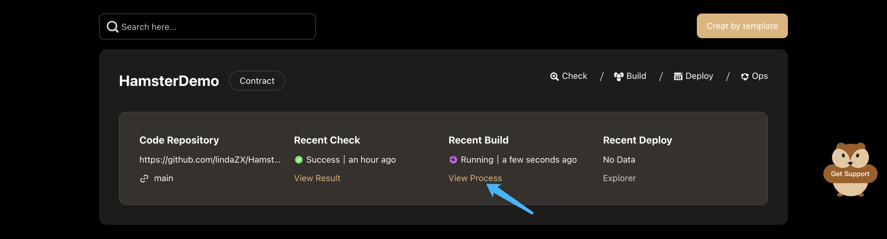

# Build Contract

When codes need to be changed or updated, you can execute contract compilation by one click.
The Execution process is automatic without manual intervention.

## Execute Building

click the **Build** button in the **contract project** card, to build the contract.

When the building workflow is being executed, click the **View Process** button to view the process.

## View Execution Process

Hamster show the Execution Process by visual pipeline, You can see all built-in work nodes and the time each one takes. 

Click each work node，you can see the Execution log of this work node. Like this:

## View Contract Artifact

To view contract artifact, choose a project from the **project list**, then, click the project name to go to the **project detail** page.

You can Find the latest build workflow in the workflows area of **project detail** page.
Click the **Detail** button to go to the **build detail** page.

Then，you can find the contracts of this build workflow.

