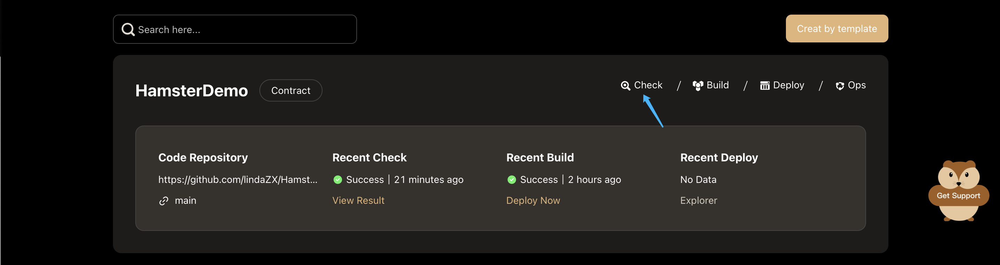
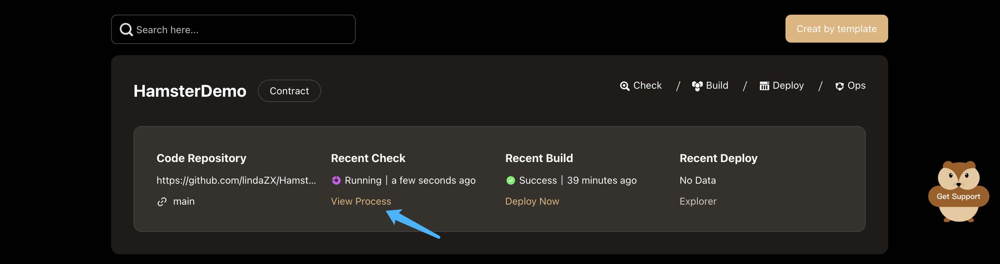
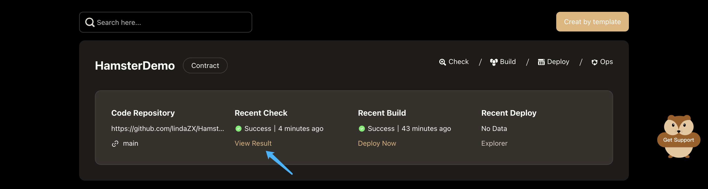
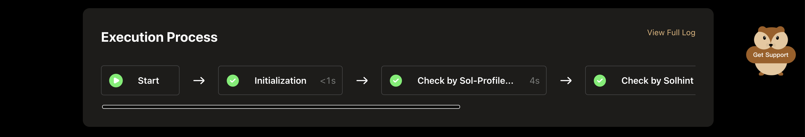
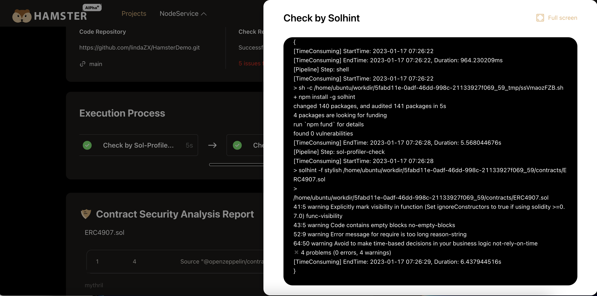
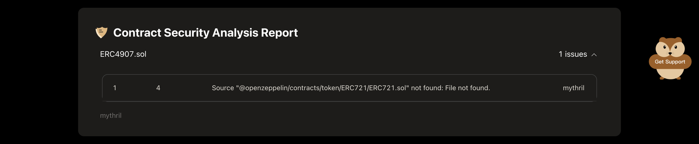
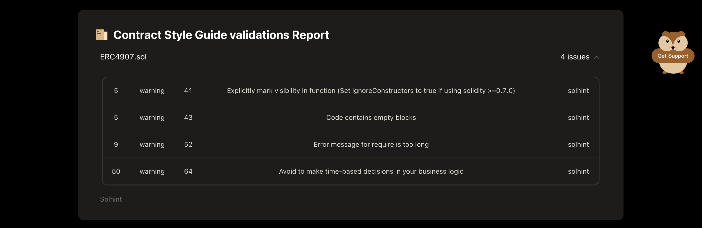

# Check Contract

Hamster will conduct all-round inspections on smart contracts, including security analysis, contract style specification inspection. 
The Execution process is automatic without manual intervention.

## Execute checking

click the **Check** button in the **contract project** card, to check the contract.

When the checking workflow is being executed, click the **View Process** button to view the process.

When the checking workflow is completed, click the **View Result** button to view the checking report.

## View Execution Process

Hamster show the Execution Process by visual pipeline, You can see all built-in work nodes and the time each one takes. 

Click each work node，you can see the Execution log of this work node. Like this:

## Contract Security Analysis

After the contract check is successfully executed, the security analysis results will be displayed. Like this:

All contract code files with problems in the project will be displayed in this area.
Click the problems file name to display the problems, the content includes: the row and column where the problem occurred, the problem description, and the check tool.

## Contract Style Guide validations

After the contract check is successfully executed, the Contract Style Guide validations results will be displayed. Like this:

All contract code files with problems in the project will be displayed in this area.
Click the problems file name to display the problems, the content includes: the row and column where the problem occurred, the problem description, and the check tool.

