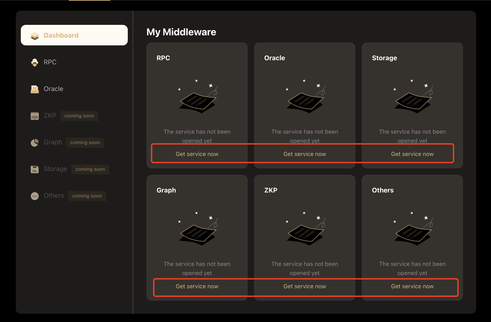
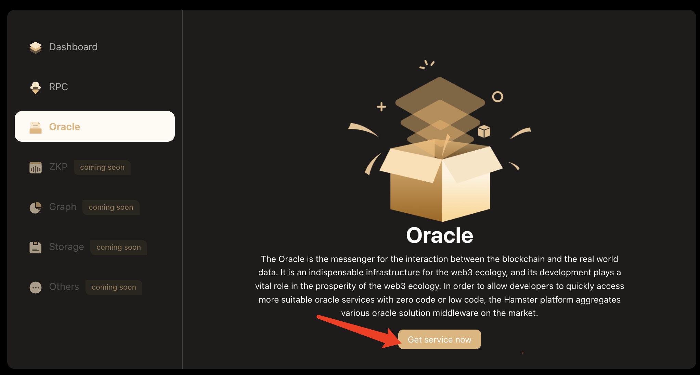
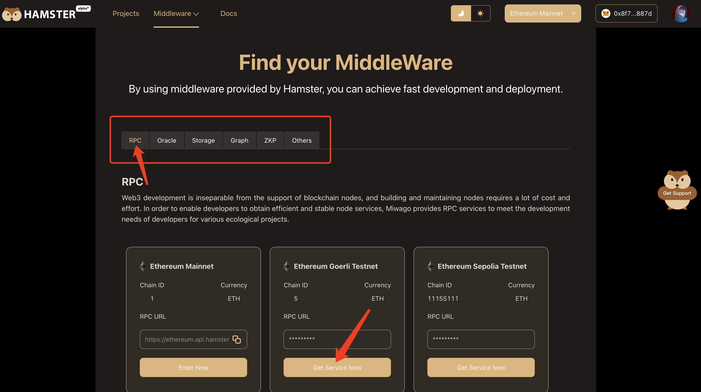
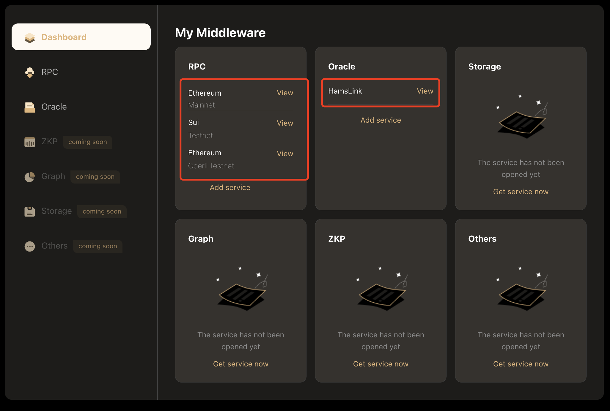
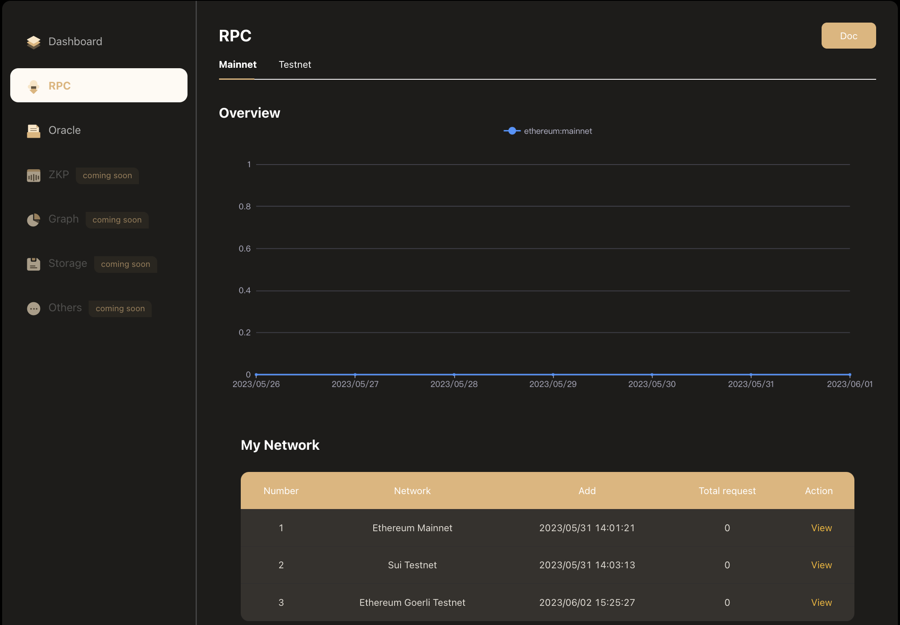
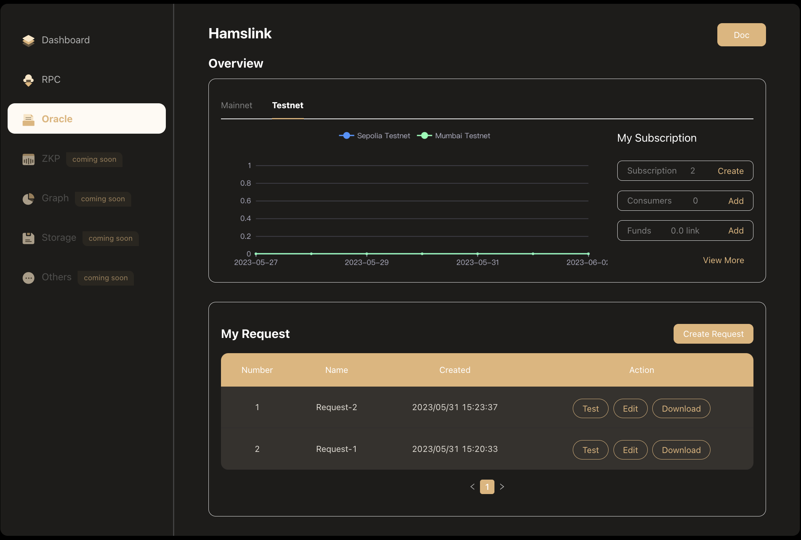

# Getting Started

## Get service
### Enter Miwaspace
There are three ways to enter Miwaspace.

1.Enter from the navigation bar

2.Enter from Dashboard shortcut

3.Enter from the defaultp page

### Get server now
Select the corresponding category -> Find the target middleware -> Click the "Get service now" button - Complete.

## View acquired services
There are two ways to view the middleware services you get.

1.View on the dashboard
You can quickly view information about all the middleware services you have activated in the dashboard.

2.Check it out on the middleware home page
On the middleware homepage, you can view detailed information about the corresponding middleware.

## Using middleware services
Different middlewares have different usage methods. See the "User Guide" for details.
