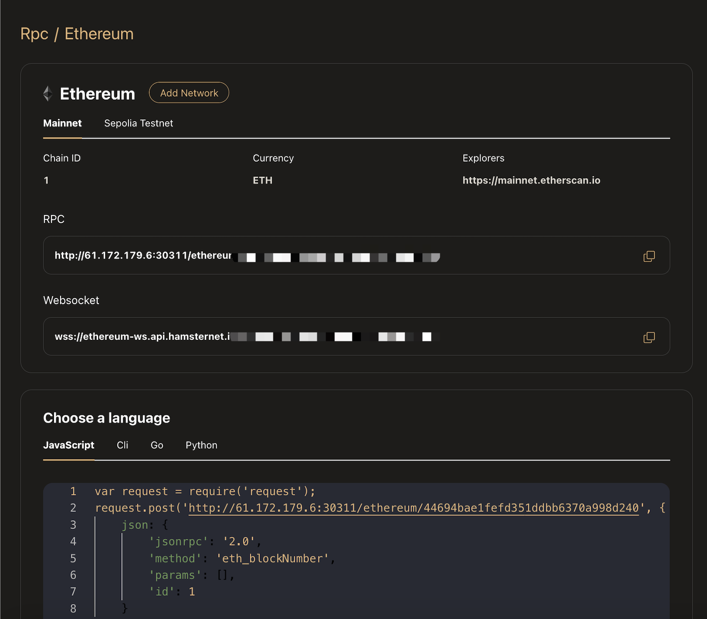

# RPC
RPC services provide stable and efficient multi-chain node services for users, allowing their projects to interact with the blockchain with confidence.

## Getting Started
View [Getting Started](../../Getting%20Started/GettingStarted.md)

## Network Details
Click "Middleware/Dashboard/RPC/My Network/View" to enter the RPC network details page, as shown below:

1.Copy the URL and paste it into your project's library or config file.

2.Click "Add Network" to add EVM series networks to MetaMask Wallet.

## Monitoring
In addition to viewing the RPC usage data of each network in the last 7 days on the home page, you can also view the service call records in the details page of each network, as shown below.

