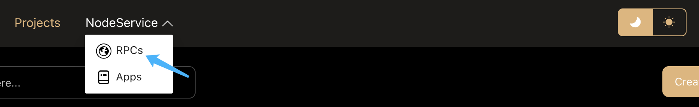
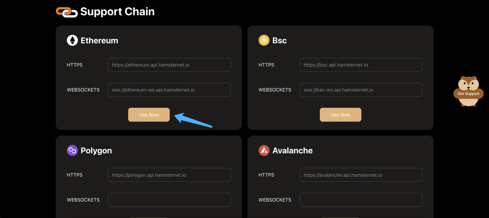
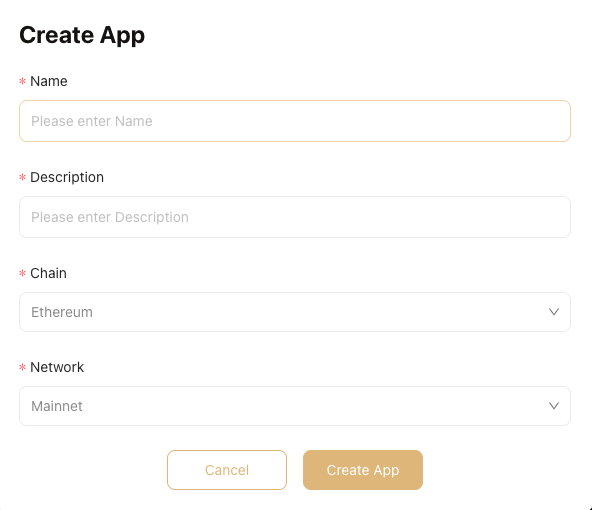
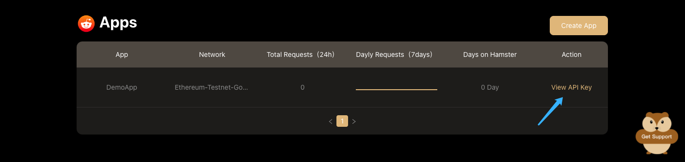
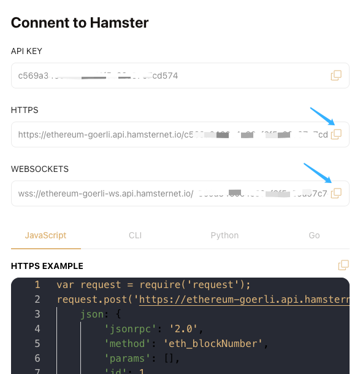
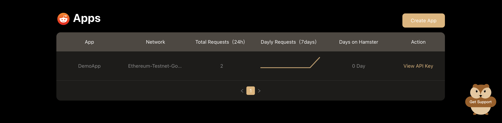

# Use RPC service

After successfully logging in to Hamster, click **NodeService** -> **RPCs** from topbar to use RPC Service.

## Use public endpoints

To enable your project to interact with a blockchain, add the blockchain's endpoint into the project's library or config file.

1. In the **Support Chain** page, click the **Use Now** button from a chain card you'd like to query.

2. Create App with basic infomation.

- Name: name the app the same as your project name for future management.
- Description: briefly describe your app.
- Chain & Network: select a network(Mainnet/Testnet)needed for your project.
- After the information is confirmed to be correct, click the **Create App** button to create app.

3. After the app is successfully created, click the **View API Key** button to query the URL.

4. Copy the URL and paste it into your project's library or config file.

congratulations！

you've just added a public endpoint into your project to enable blockchain interaction.

## Monitoring App

In the **Apps** page, you can view some data of your App:
- Total Requests(24h): count the number of service calls within 24 hours.
- Dayly Requests(7days): count the number of service calls per day within 7 days.
- Days on Hamster:count the number of active days on the Hamster.

## Supported Chains
- Ethereum
- Bsc
- Polygon
- Avalanche
- Optimism
- StarkWare
- Near
- Aptos
- Sui
