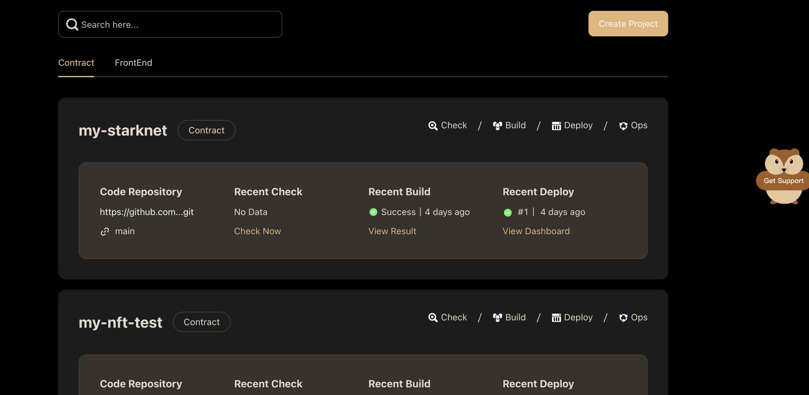
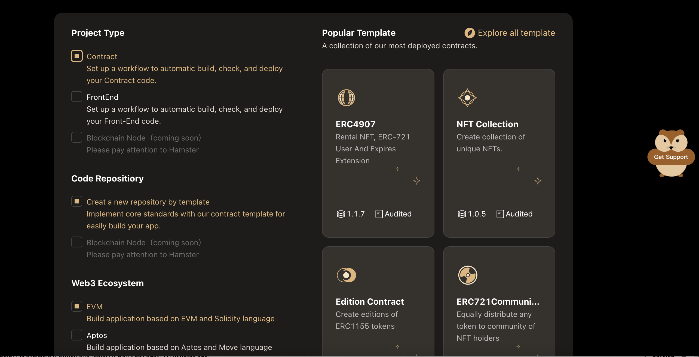
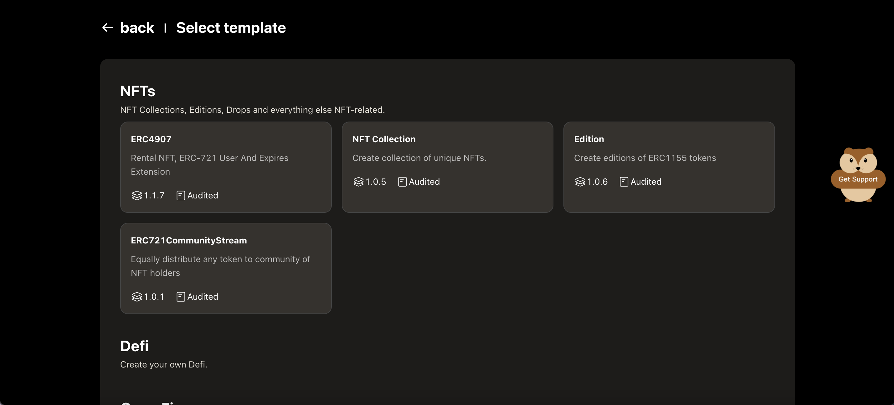

# Create a project

You can create a new project from the Hamster **project list** page by clicking on the **Create Project** button.

After going to the **Create Project** page，fill in the basic infomation of your own project first.

1. Enter the **project name** for you project. Great project names are short and memorable.
2. Select the **project type**, the best practices workflow will be set up to assist you for completing project quickly.
3. Select the **code repositiory** to get started with one of our templates or use an repository. 
4. if you selsect create a new repositiory by template,then Click the **Explore all template** button to go the **select template** page.

About **popular template** area, Hamster will give you a collection of the most deployed templates.

You can select one of these template, create your code repository to github quickly.

