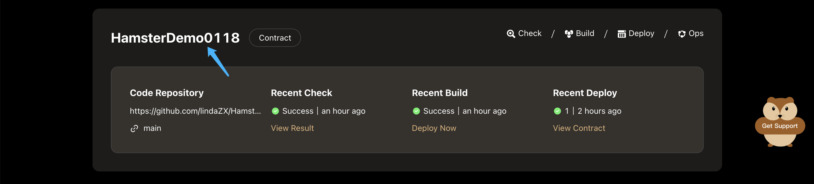
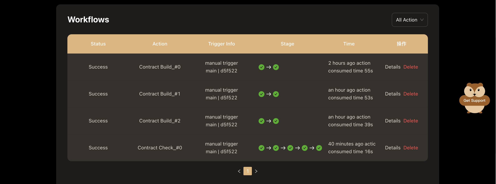
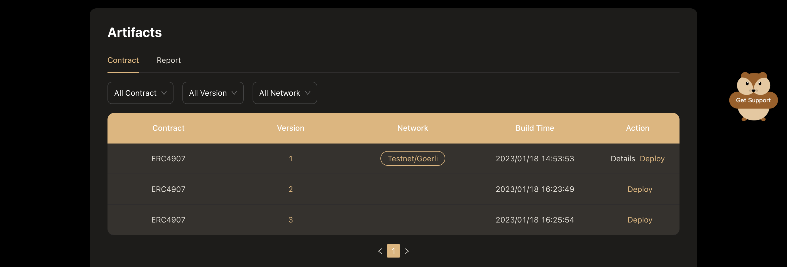
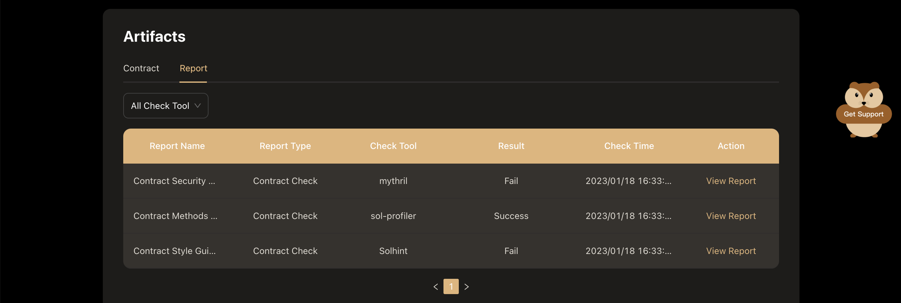

# Manage Projects

To view all the infomation of project，choose a project from the **project list** page, and click the name of project to go to the **Project Detail** page.

Then, you can get a lot of information about this project, including workflows and artifacts from the **Project Detail** page.

## View Workflow

Different types of projects will be configured with different workflows：
- The workflow for contract project includes contract checking and contract building. 
- The workflow for front-end project includes: front-end code checking, front-end code building, and front-end code deployment.

All executed workflows of the project can be viewed in the workflow area, including the workflow being executed and the historical execution records.

In this area，you can do：
- Filter out the workflow of the specified type by the drop-down selection box at the top right.
- Click the **Details** button to view the details of the corresponding workflow.
- Click the **Delete** button to delete the corresponding workflow record.

## View Artifacts

All artifacts generated on Hamsters of the project will be displayed in the artifacts area:
- The main artifacts of a contract project are contracts and contract check reports.
- The main artifacts of a Front-End project are Front-End package and front-end code check reports. 

### View contract Artifacts

In the **Artifacts** area, click the **Contracts** tab to view all the contracts built by Hamster, and the deployment of each contract in each chain.

In this area，you can do：
- Filter out the contract by the drop-down selection box.
- Click the **Deploy** button to go to the **Deploy Contract** page.
- When the contract has been deployed, click the **Detail** button to explore this contract.

### View contract Reports

In the **Artifacts** area, click the **Reports** tab to view all the contract check report.

In this area，you can do：
- Click the **View Report** button to view the detail infomation of this report.
